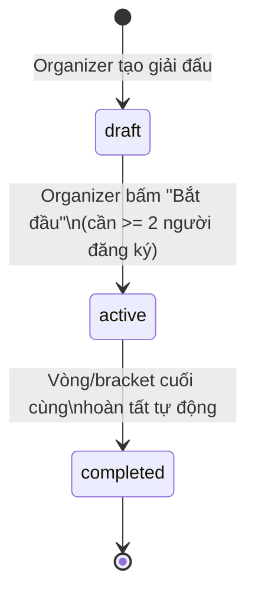
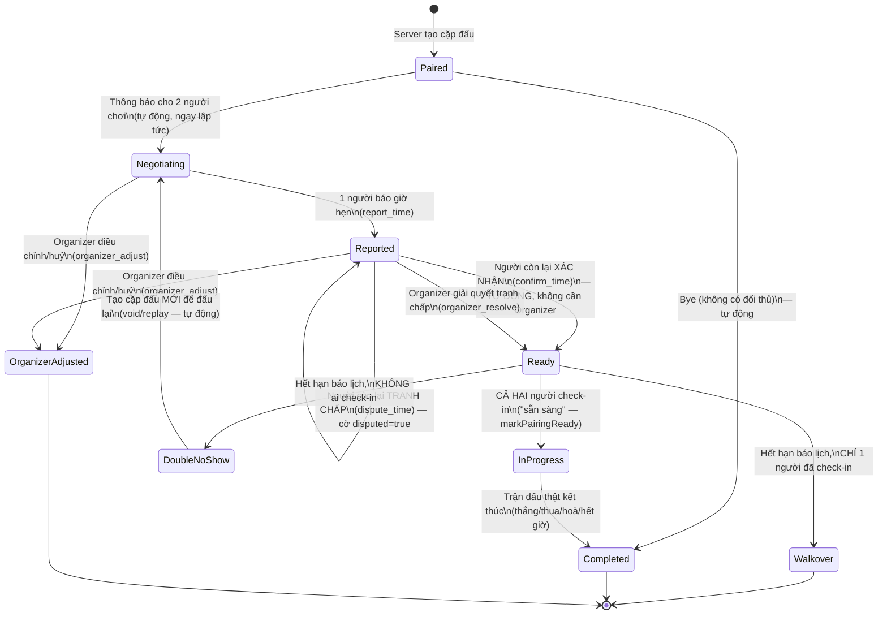

# Báo cáo: Luồng Organizer & Player trong tính năng Tournament

**Ngày viết:** 2026-08-05
**Phạm vi:** Toàn bộ vòng đời giải đấu (Tables & Tournaments — TODO.md #48 / instruction.md B48),
từ lúc tạo giải đấu tới lúc một trận đấu thật kết thúc, chia theo góc nhìn **Organizer** (người tổ
chức) và **Player** (người chơi). Bao gồm rõ phần **đã có UI thật** (Phase 5) và phần **chỉ mới có ở
tầng socket, chưa có UI** (Phase 4) — để không hiểu nhầm "đã code" nghĩa là "người dùng bấm được".

Nguồn: `server/managers/tournament/TournamentManager.js`, `PairingLifecycle.js`,
`server/socket/handlers/TournamentHandler.js`, `TournamentMatchHandler.js`, `client/js/tournaments.js`.

---

## 1. Tổng quan kiến trúc

Một giải đấu đi qua 3 trạng thái lớn:

- **draft** — đang mở đăng ký, chưa có cặp đấu nào.
- **active** — đã sinh cặp đấu vòng 1 (Swiss/Round robin) hoặc bracket (Double Elimination); các
  cặp đấu tự vận hành qua vòng đời riêng (mục 4).
- **completed** — mọi cặp đấu đã xong, xếp hạng cuối cùng được tính.

Bên trong một giải đấu `active`, **mỗi cặp đấu (pairing) có vòng đời trạng thái riêng** — đây là
phần phức tạp nhất và là nơi Organizer/Player thực sự tương tác nhiều nhất.

---

## 2. Vai trò & quyền hạn

| Vai trò | Là gì | Quyền hạn chính |
|---|---|---|
| **Organizer** | Người tạo giải đấu (`organizerId`) | Bắt đầu giải đấu; giải quyết tranh chấp giờ; điều chỉnh/huỷ một cặp đấu; duyệt/từ chối yêu cầu đổi lịch |
| **Player** | Người đã đăng ký (`entryId`) | Đăng ký/huỷ đăng ký (khi còn `draft`); báo giờ thi đấu; xác nhận/tranh chấp giờ đối thủ báo; xin đổi lịch; check-in ("sẵn sàng"); chơi trận thật |

**Lưu ý quan trọng:** Organizer **được phép tự đăng ký làm Player trong chính giải đấu mình tổ
chức** (không bị cấm) — một người có thể vừa là Organizer vừa là Player. Ngược lại, một Player
bình thường **không** có quyền Organizer (không thể bắt đầu giải, không thể giải quyết tranh chấp).

---

## 3. Luồng Organizer

### 3.1. Tạo giải đấu — ✅ đã có UI

1. Tab **"Giải đấu"** → nút **"Tạo giải đấu"**.
2. Điền tên (tuỳ chọn), chọn **thể thức** (Swiss / Round robin / Double Elimination), chọn luật
   bàn cờ (kích thước, luật thắng, Tường/Cổng dịch chuyển, Swap2), chế độ giờ, và **hạn báo lịch
   mỗi trận** (mặc định 48 giờ — xem mục 5).
3. Bấm "Tạo giải đấu" → emit `tournament:create` → server tạo giải đấu ở trạng thái `draft`,
   người tạo tự động trở thành **Organizer**.

### 3.2. Bắt đầu giải đấu — ✅ đã có UI

- Chỉ hiện nút **"Bắt đầu"** trên thẻ giải đấu khi: bạn là Organizer, giải đấu còn `draft`, và
  **đã có ít nhất 2 người đăng ký**.
- Bấm "Bắt đầu" → emit `tournament:start` → server:
  - Chuyển trạng thái giải đấu sang `active`.
  - **Tự động sinh cặp đấu** theo thể thức đã chọn (không cần Organizer làm gì thêm):
    - **Swiss**: sinh cặp vòng 1 (ghép theo điểm, số vòng = `ceil(log2(số người))` trừ khi cấu
      hình khác).
    - **Round robin**: sinh **toàn bộ lịch thi đấu mọi vòng** ngay từ đầu (thuật toán vòng tròn).
    - **Double Elimination**: sinh **bracket đầy đủ** (nhánh thắng + nhánh thua + chung kết), số
      người lẻ được đôn lên luỹ thừa của 2 bằng bye tự động.
  - Nếu số người lẻ, người bị bye ở vòng đó **tự động thắng** ván đó (không cần chơi).

### 3.3. Can thiệp vào một cặp đấu — ⚠️ CHƯA có UI (chỉ có ở tầng socket)

Đây là phần **đã code xong ở server (Phase 4) nhưng chưa có nút bấm nào trên giao diện** — tức
là về mặt kỹ thuật hệ thống làm được, nhưng người dùng thật hiện **không thể tự thao tác** những
việc này qua trình duyệt:

| Hành động | Khi nào dùng | Sự kiện socket |
|---|---|---|
| **Giải quyết tranh chấp giờ** | 2 người chơi không thống nhất được giờ thi đấu (1 bên bấm "tranh chấp") | `tournament:organizer_resolve` |
| **Điều chỉnh/Huỷ cặp đấu** | Cặp đấu có vấn đề cần Organizer can thiệp thủ công (VD: 1 người vi phạm) | `tournament:organizer_adjust` |
| **Duyệt yêu cầu đổi lịch** | Một người chơi xin đổi giờ đã thống nhất trước đó | `tournament:approve_reschedule` |
| **Từ chối yêu cầu đổi lịch** | Organizer không đồng ý đổi lịch | `tournament:deny_reschedule` |

→ Đây chính là phần được ghi rõ là **"Phase 6" còn thiếu** trong
`docs/instruction/B48-tournament-tables-tournaments-tu-yeu-cau-nguoi-dung.md` — cần một trang chi
tiết giải đấu (danh sách cặp đấu + các nút thao tác trên) trước khi Organizer thật sự dùng được.

---

## 4. Luồng Player

### 4.1. Đăng ký / Huỷ đăng ký — ✅ đã có UI

- Trên mỗi thẻ giải đấu còn `draft`: nút **"Đăng ký"** (nếu chưa đăng ký) hoặc **"Huỷ đăng ký"**
  (nếu đã đăng ký) → emit `tournament:register` / `tournament:unregister`.
- **Một người có thể đăng ký nhiều giải đấu cùng lúc** (quyết định 6 trong `planning.md` — không
  giới hạn như phòng chơi thường, nơi 1 người chỉ ở 1 phòng).
- Khách (guest) đăng ký được bình thường, không cần tài khoản.
- Không thể đăng ký/huỷ đăng ký sau khi giải đấu đã `active`.

### 4.2. Sau khi giải đấu bắt đầu: vòng đời một cặp đấu — ⚠️ CHƯA có UI

Khi giải đấu chuyển `active`, mỗi Player được ghép cặp sẽ có một **cặp đấu (pairing)** đi qua
vòng đời trạng thái sau (file `PairingLifecycle.js`):

**Diễn giải từng bước cho Player:**

1. **Paired → Negotiating** (tự động): ngay khi có cặp đấu, cả 2 người chơi được thông báo (đối
   với Double Elimination, cặp đấu chỉ được tạo khi cả 2 "ô" của trận đã có người thắng từ vòng
   trước — sinh dần theo tiến độ bracket, không sinh sẵn hết).
2. **Báo giờ** (`report_time`): **BẤT KỲ ai trong 2 người** có thể báo giờ hẹn thi đấu trước
   (không bắt buộc là ai — tự thoả thuận ngoài hệ thống rồi 1 người nhập vào).
3. **Xác nhận** (`confirm_time`): người **CÒN LẠI** (không phải người vừa báo giờ) xác nhận →
   cặp đấu chuyển thẳng sang `Ready`, **không cần Organizer duyệt** — đây là một diễn giải đã
   được ghi nhận rõ trong quá trình code (xem mục 6).
4. **Tranh chấp** (`dispute_time`): nếu người còn lại không đồng ý giờ đã báo → đánh dấu tranh
   chấp, chờ Organizer giải quyết (mục 3.3).
5. **Xin đổi lịch** (`request_reschedule`): sau khi đã `Ready` (có giờ thống nhất), một trong 2
   người vẫn có thể xin đổi giờ khác — nhưng **cần Organizer duyệt** (`approve_reschedule` /
   `deny_reschedule`), không được tự đổi (quyết định 3 trong `planning.md`).
   - **Lưu ý:** duyệt đổi lịch chỉ đổi giờ hẹn (`agreedTime`), **KHÔNG** gia hạn lại hạn chót báo
     lịch (`deadline`) — hạn chót luôn tính từ lúc cặp đấu được tạo, không phải từ lần đổi lịch
     gần nhất.
6. **Check-in / "Sẵn sàng"** (`ready` / markPairingReady): tới giờ hẹn, **cả 2 người** phải tự
   bấm "sẵn sàng". Khi **cả hai** đã bấm → cặp đấu chuyển `InProgress`, đồng hồ tính giờ trận đấu
   bắt đầu chạy ngay lúc đó.
7. **Chơi trận thật** — xem mục 4.3.

### 4.3. Chơi trận thật — ⚠️ CHƯA có UI (chỉ có ở tầng socket)

Khi cặp đấu vào `InProgress`, server **tự động** tạo một ván cờ thật (dùng đúng bộ máy luật chơi
`GameEngine` — y hệt phòng chơi thường, không phải bản giả lập riêng) và đưa 2 người chơi vào một
"phòng" Socket.io riêng cho trận đó. Các sự kiện điều khiển ván cờ đã có sẵn ở server:

| Sự kiện | Ý nghĩa |
|---|---|
| `tmatch:move` | Đặt quân |
| `tmatch:swap2_place` / `tmatch:swap2_choice` | Các bước mở màn Swap2 (nếu giải đấu bật luật này) |
| `tmatch:resign` | Đầu hàng |

Trận kết thúc tự động khi: thắng 5 quân liên tiếp, hoà (đầy bàn cờ), đầu hàng, hoặc **hết giờ**
(đồng hồ đếm ngược riêng cho từng trận, không dùng chung với phòng thường).

**Nhưng hiện tại KHÔNG có bàn cờ nào trên giao diện để bấm các nút này** — đây là phần lớn nhất
còn thiếu để một Player thực sự "chơi" được một trận trong giải đấu.

### 4.4. Không tham gia đúng hẹn thì sao? (tự động, Player không cần làm gì)

- **Chỉ 1 người check-in đúng hạn** → người đó **thắng theo thể thức "walkover"** (thắng round,
  không có hình phạt gì thêm — quyết định 1 trong `planning.md`), cặp đấu kết thúc.
- **Không ai check-in đúng hạn** → cặp đấu bị huỷ, hệ thống **tự tạo một cặp đấu MỚI để đấu lại**
  từ đầu (Swiss/Round robin: cặp đấu mới với ID mới; Double Elimination: **reset lại đúng cặp đấu
  cũ, giữ nguyên ID** — vì các trận khác trong bracket đã tham chiếu tới ID đó).
- **Kết quả hoà trong Double Elimination**: bracket không có chỗ cho kết quả hoà (phải có người
  thắng để đi tiếp) — nếu trận đấu thật kết thúc hoà, hệ thống tự huỷ + tạo lại cặp đấu để đấu lại,
  y hệt cơ chế "không ai check-in" ở trên.

---

## 5. Cơ chế "hạn báo lịch" (deadline) — điều khiển ngầm, không cần ai bấm gì

- Mỗi cặp đấu có **một hạn chót duy nhất** (`deadline`), mặc định **48 giờ** kể từ lúc cặp đấu
  được tạo (Organizer có thể chỉnh khi tạo giải đấu, ô "Hạn báo lịch mỗi trận").
- Một tiến trình nền quét mỗi **10 giây** (không phải quét mỗi cặp đấu riêng — quét 1 danh sách
  dùng chung, giống cơ chế dọn phòng rảnh của phòng chơi thường) để tìm cặp đấu đã quá hạn mà
  chưa vào `InProgress`, rồi tự xử lý theo đúng nhánh ở mục 4.4.
- **Player/Organizer không cần chủ động làm gì để hạn chót "chạy"** — nó luôn chạy ngầm; chỉ cần
  biết rằng **không hành động trước hạn = tự động xử lý theo luật trên**.

---

## 6. Hai điểm diễn giải cần lưu ý (không phải lỗi — quyết định thiết kế khi code)

1. **"Xác nhận giờ" không cần Organizer duyệt** — dù sơ đồ trạng thái gốc có nhãn "Organizer xác
   nhận", thực tế chỉ cần **2 người chơi tự thống nhất** (báo giờ + xác nhận) là đủ để chuyển sang
   `Ready`. Organizer **chỉ** vào cuộc khi có **tranh chấp**.
2. **Duyệt đổi lịch không gia hạn hạn chót** — hạn chót (`deadline`) luôn cố định từ lúc cặp đấu
   được tạo ra, kể cả sau khi đổi lịch thành công.

---

## 7. Tóm tắt: ai bấm được gì ngay bây giờ (trên UI thật)

| Việc | Ai | Có UI? |
|---|---|---|
| Tạo giải đấu | Bất kỳ ai (tự thành Organizer) | ✅ |
| Đăng ký / huỷ đăng ký | Player | ✅ |
| Bắt đầu giải đấu | Organizer | ✅ |
| Xem danh sách giải đấu, lọc theo trạng thái/thể thức | Ai cũng xem được | ✅ |
| Báo giờ / xác nhận / tranh chấp giờ thi đấu | Player | ❌ chưa có UI |
| Check-in ("sẵn sàng") vào giờ hẹn | Player | ❌ chưa có UI |
| Chơi trận thật (đặt quân, đầu hàng...) | Player | ❌ chưa có UI |
| Giải quyết tranh chấp / điều chỉnh cặp đấu / duyệt đổi lịch | Organizer | ❌ chưa có UI |

→ Nói ngắn gọn: **toàn bộ "bộ não" điều khiển giải đấu đã chạy đúng và có test đầy đủ ở server**
(714/714 test xanh), nhưng **từ lúc giải đấu chuyển sang `active` trở đi, người chơi thật chưa có
cách nào thao tác qua giao diện** — mọi hành động ở mục 3.3, 4.2, 4.3 hiện chỉ gọi được bằng cách
tự phát sự kiện socket thủ công (VD qua DevTools), không phải luồng người dùng bình thường.

## 8. Việc cần làm tiếp (Phase 6, chưa bắt đầu)

Theo đúng quy tắc "mockup trước, code sau" đã thống nhất, Phase 6 cần **thiết kế mockup trước**
cho:

1. **Trang chi tiết giải đấu** — danh sách cặp đấu theo vòng/nhánh bracket, bảng xếp hạng, các nút
   thao tác của mục 3.3 dành cho Organizer.
2. **UI lịch trình cặp đấu** — báo giờ, xác nhận, tranh chấp, xin đổi lịch, check-in — cho từng
   cặp đấu của chính người dùng.
3. **Bàn cờ chơi trận thật cho tournament** — tái sử dụng giao diện bàn cờ đã có ở `room.html`,
   nối vào các sự kiện `tmatch:*` đã sẵn sàng ở server.

Chưa nên code phần này khi chưa có mockup được duyệt.
