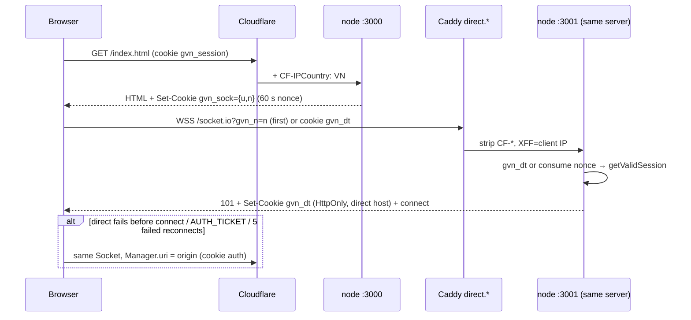

# Socket route choice (#415)
Links: [planning](../../planning.md)

```mermaid
sequenceDiagram
  participant B as Browser
  participant CF as Cloudflare
  participant N3000 as node :3000
  participant C as Caddy direct.*
  participant N3001 as node :3001 (same server)
  B->>CF: GET /index.html (cookie gvn_session)
  CF->>N3000: + CF-IPCountry: VN
  N3000-->>B: HTML + Set-Cookie gvn_sock={u,n} (60 s nonce)
  B->>C: WSS /socket.io?gvn_n=n (first) or cookie gvn_dt
  C->>N3001: strip CF-*, XFF=client IP
  N3001->>N3001: gvn_dt or consume nonce → getValidSession
  N3001-->>B: 101 + Set-Cookie gvn_dt (HttpOnly, direct host) + connect
  alt direct fails before connect / AUTH_TICKET / 5 failed reconnects
    B->>CF: same Socket, Manager.uri = origin (cookie auth)
  end
```
