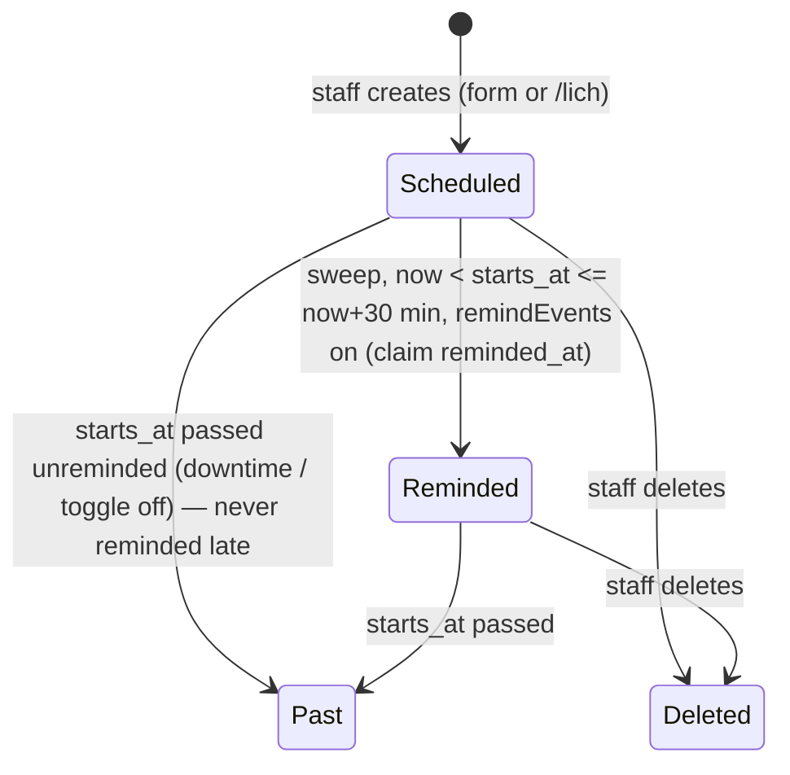

# Club event — state

```mermaid
stateDiagram-v2
  [*] --> Scheduled: staff creates (form or /lich)
  Scheduled --> Reminded: sweep, now < starts_at <= now+30 min, remindEvents on (claim reminded_at)
  Scheduled --> Past: starts_at passed unreminded (downtime / toggle off) — never reminded late
  Reminded --> Past: starts_at passed
  Scheduled --> Deleted: staff deletes
  Reminded --> Deleted: staff deletes
```
