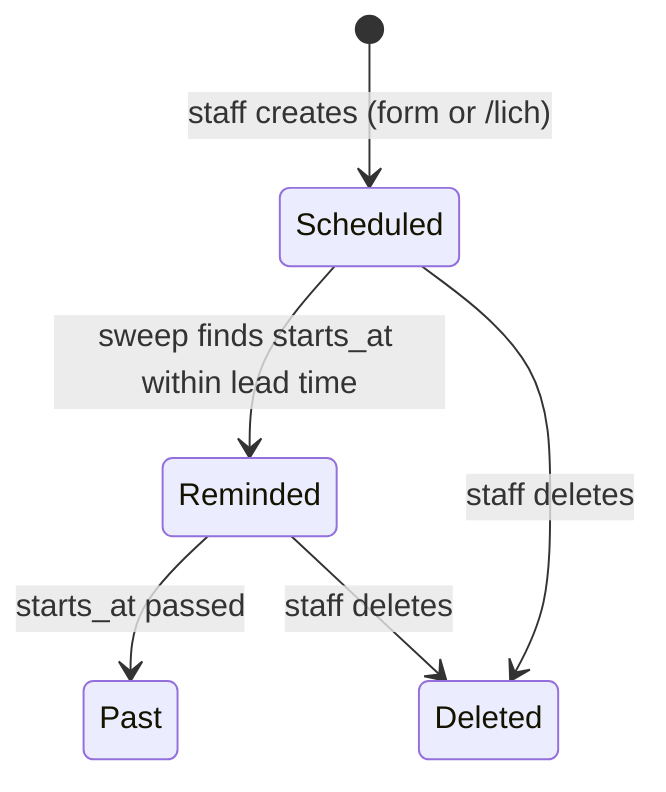

# Club event — state

```mermaid
stateDiagram-v2
  [*] --> Scheduled: staff creates (form or /lich)
  Scheduled --> Reminded: sweep finds starts_at within lead time
  Reminded --> Past: starts_at passed
  Scheduled --> Deleted: staff deletes
  Reminded --> Deleted: staff deletes
```
