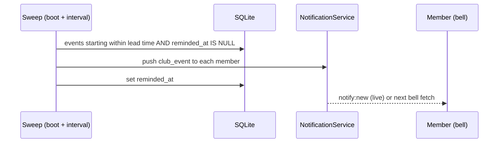

# Club event reminder — sequence

```mermaid
sequenceDiagram
  participant T as Sweep (boot + interval)
  participant DB as SQLite
  participant N as NotificationService
  participant U as Member (bell)
  T->>DB: events starting within lead time AND reminded_at IS NULL
  T->>N: push club_event to each member
  T->>DB: set reminded_at
  N-->>U: notify:new (live) or next bell fetch
```
