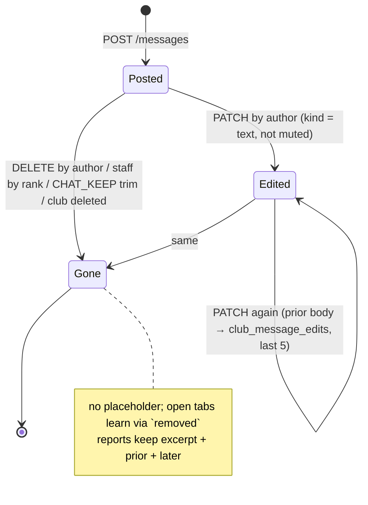
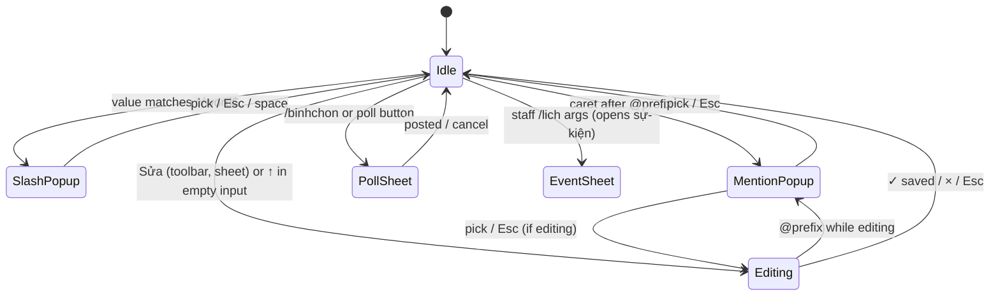
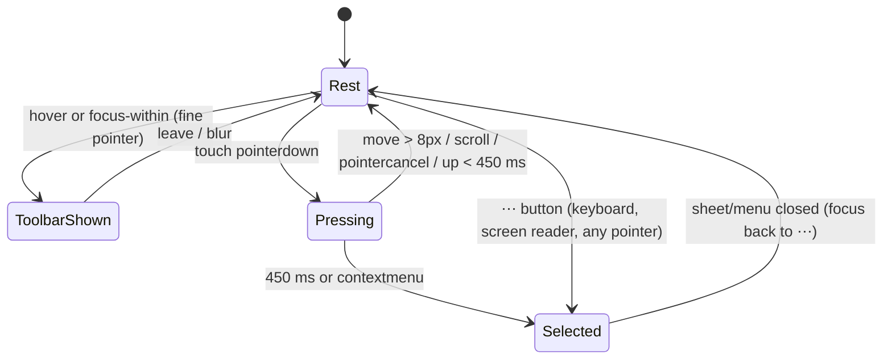

# States
[Stories](../user_story.md) · [Planning](../planning.md) · [Sequences](uml_diagram/sequence.md)

## A chat message (server)

```mermaid
stateDiagram-v2
  [*] --> Posted: POST /messages
  Posted --> Edited: PATCH by author (kind = text, not muted)
  Edited --> Edited: PATCH again (prior body → club_message_edits, last 5)
  Posted --> Gone: DELETE by author / staff by rank / CHAT_KEEP trim / club deleted
  Edited --> Gone: same
  Gone --> [*]
  note right of Gone
    no placeholder; open tabs learn via `removed`
    reports keep excerpt + prior + later
  end note
```

## Composer (client)

```mermaid
stateDiagram-v2
  [*] --> Idle
  Idle --> SlashPopup: value matches ^/word$
  Idle --> MentionPopup: caret after @prefix
  SlashPopup --> Idle: pick / Esc / space
  MentionPopup --> Idle: pick / Esc
  Idle --> Editing: Sửa (toolbar, sheet) or ↑ in empty input
  Editing --> MentionPopup: @prefix while editing
  MentionPopup --> Editing: pick / Esc (if editing)
  Editing --> Idle: ✓ saved / × / Esc
  Idle --> PollSheet: /binhchon or poll button
  Idle --> EventSheet: staff /lich args (opens sự-kiện)
  PollSheet --> Idle: posted / cancel
```

## Message row actions (client)

```mermaid
stateDiagram-v2
  [*] --> Rest
  Rest --> ToolbarShown: hover or focus-within (fine pointer)
  ToolbarShown --> Rest: leave / blur
  Rest --> Pressing: touch pointerdown
  Pressing --> Rest: move > 8px / scroll / pointercancel / up < 450 ms
  Pressing --> Selected: 450 ms or contextmenu
  Rest --> Selected: ⋯ button (keyboard, screen reader, any pointer)
  Selected --> Rest: sheet/menu closed (focus back to ⋯)
```
