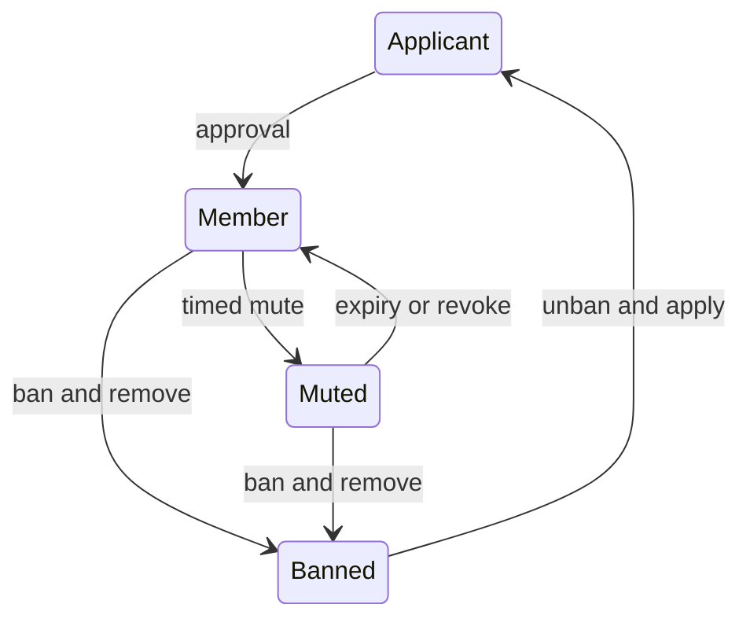

[Plan](../planning.md) · [Stories](../user_story.md) · [Sequence](uml_diagram/sequence.md)

```mermaid
stateDiagram-v2
    Applicant --> Member: approval
    Member --> Muted: timed mute
    Muted --> Member: expiry or revoke
    Member --> Banned: ban and remove
    Muted --> Banned: ban and remove
    Banned --> Applicant: unban and apply
```
