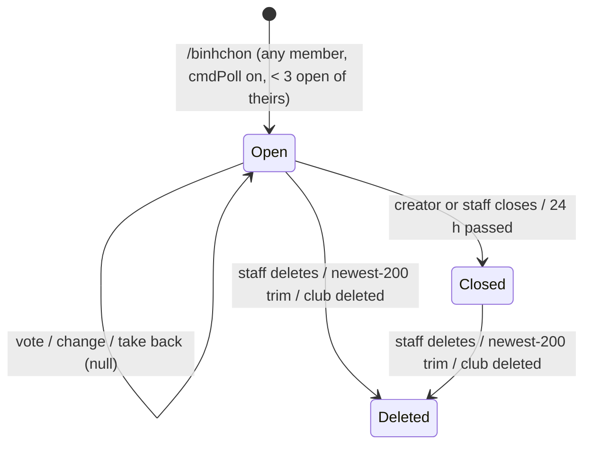

# Club poll — state

Closed is lazy: `closed_at` set, or now ≥ `closes_at` (created + 24 h). No timer.

```mermaid
stateDiagram-v2
  [*] --> Open: /binhchon (any member, cmdPoll on, < 3 open of theirs)
  Open --> Open: vote / change / take back (null)
  Open --> Closed: creator or staff closes / 24 h passed
  Open --> Deleted: staff deletes / newest-200 trim / club deleted
  Closed --> Deleted: staff deletes / newest-200 trim / club deleted
```
