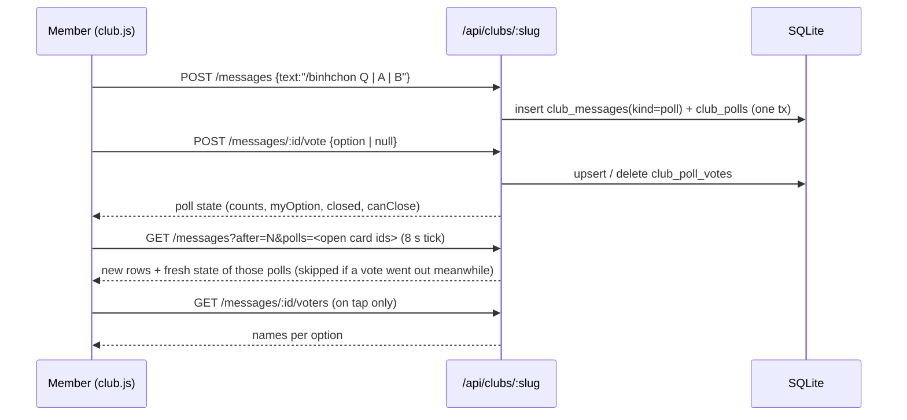

# Club poll — sequence

```mermaid
sequenceDiagram
  participant M as Member (club.js)
  participant S as /api/clubs/:slug
  participant DB as SQLite
  M->>S: POST /messages {text:"/binhchon Q | A | B"}
  S->>DB: insert club_messages(kind=poll) + club_polls (one tx)
  M->>S: POST /messages/:id/vote {option | null}
  S->>DB: upsert / delete club_poll_votes
  S-->>M: poll state (counts, myOption, closed, canClose)
  M->>S: GET /messages?after=N&polls=<open card ids> (8 s tick)
  S-->>M: new rows + fresh state of those polls (skipped if a vote went out meanwhile)
  M->>S: GET /messages/:id/voters (on tap only)
  S-->>M: names per option
```
