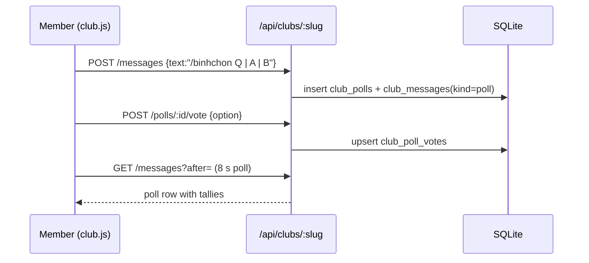

# Club poll — sequence

```mermaid
sequenceDiagram
  participant M as Member (club.js)
  participant S as /api/clubs/:slug
  participant DB as SQLite
  M->>S: POST /messages {text:"/binhchon Q | A | B"}
  S->>DB: insert club_polls + club_messages(kind=poll)
  M->>S: POST /polls/:id/vote {option}
  S->>DB: upsert club_poll_votes
  M->>S: GET /messages?after= (8 s poll)
  S-->>M: poll row with tallies
```
