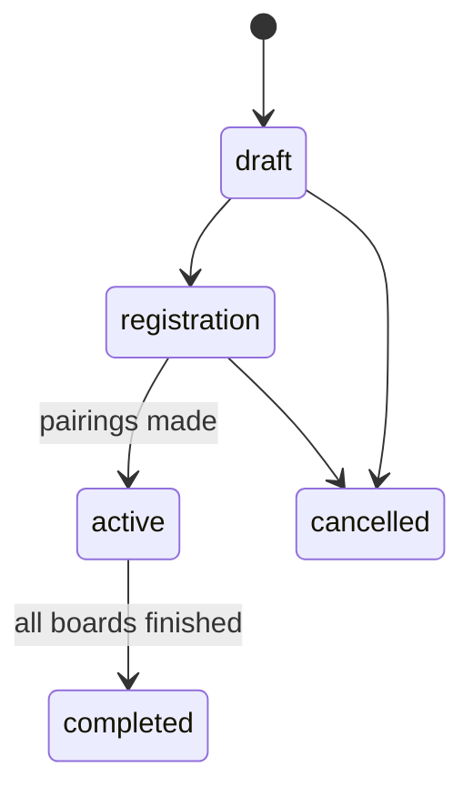

# State (draft)

```mermaid
stateDiagram-v2
  [*] --> draft
  draft --> registration
  registration --> active: pairings made
  active --> completed: all boards finished
  draft --> cancelled
  registration --> cancelled
```
