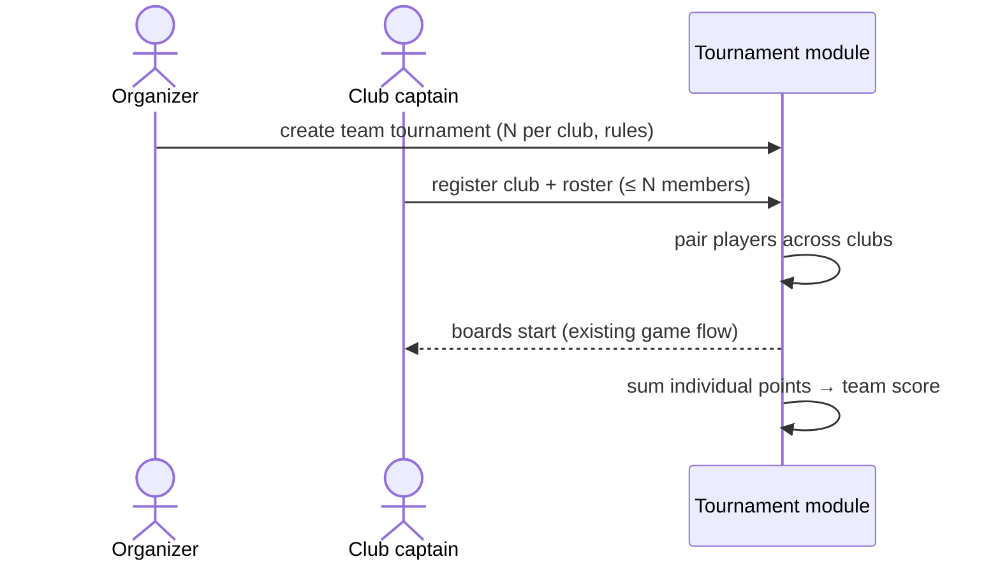

# Sequence (draft)

```mermaid
sequenceDiagram
  actor O as Organizer
  actor C as Club captain
  participant T as Tournament module
  O->>T: create team tournament (N per club, rules)
  C->>T: register club + roster (≤ N members)
  T->>T: pair players across clubs
  T-->>C: boards start (existing game flow)
  T->>T: sum individual points → team score
```
