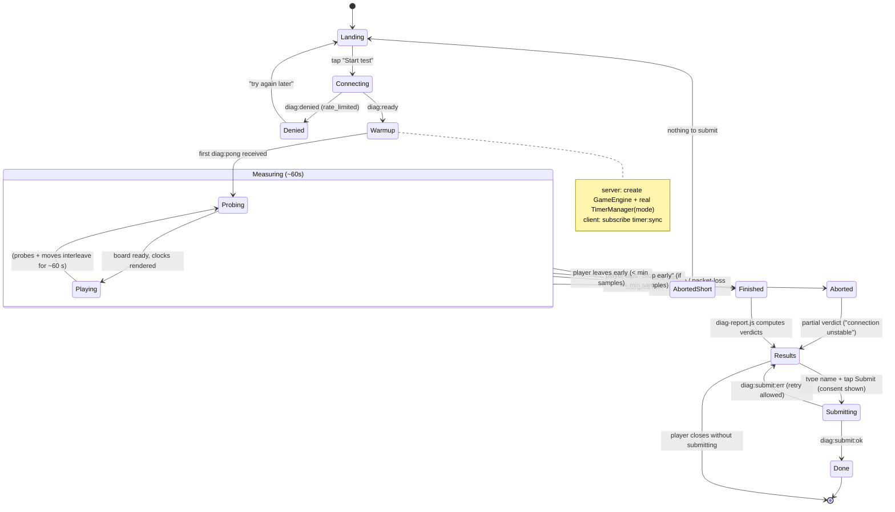

# State — diagnostic session lifecycle

Client-side `DiagProbeSession` + the paired server `/diag` session. Context:
[../planning.md](../planning.md), [../user_story.md](../user_story.md).

## Guards / invariants

- **min samples**: ≥ 30 transport probes AND ≥ 8 board moves → `Finished`; otherwise
  `AbortedShort`.
- One active session per socket; a second `Start` on the same socket is rejected server-
  side.
- The real `TimerManager` instance is destroyed on `Aborted` / `Finished` / disconnect —
  no lingering timers (mirrors room cleanup).
- Rate-limit counter increments on entering `Warmup` (a started run counts), not on submit,
  so 5 abandoned runs still exhaust the hour's budget (anti-abuse, R5).
