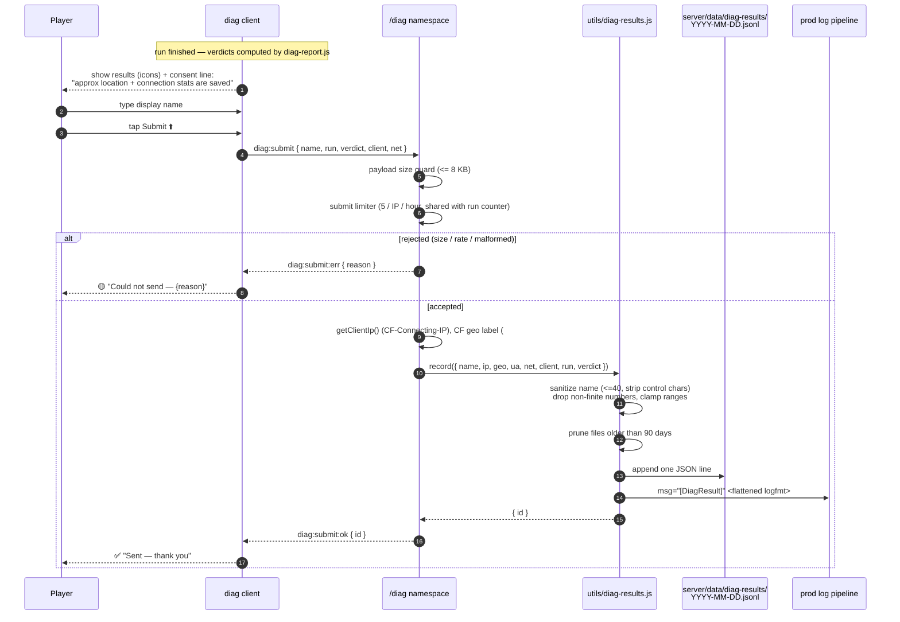

# Sequence — submit result

Measures nothing — persists the finished run. Context:
[../../planning.md](../../planning.md) "Submitted-result JSONL shape",
[../../user_story.md](../../user_story.md) R5/R6.

## Notes

- Server recomputes nothing from the client's raw samples — it stores the **aggregated**
  run the client sends, sanitized. Client timestamps never enter any timeout formula (R2).
- `[DiagResult]` logfmt line mirrors `[MoveLag]` (#164/#167) so the same grep pipeline
  works; the JSONL file is for offline percentile analysis. OQ4 decides which is primary.
- Maintainer reads via `server/scripts/diag-results.js` (CLI aggregate) — no web UI.
