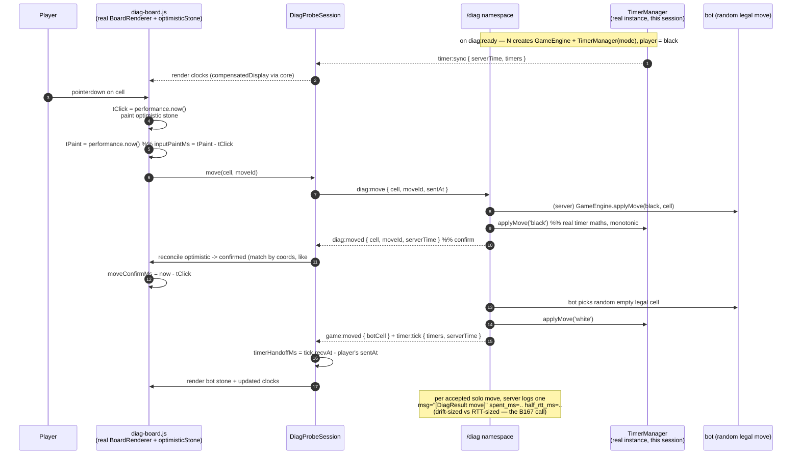

# Sequence — solo board move + timer handoff (client → server → client)

Measures **item 2 (board + action)** and **item 3 (timer tick c→s→c)** — the B167
discriminator. Context: [../../planning.md](../../planning.md).

Uses the **real** `BoardRenderer` + `optimisticStone` (#153) and a **real `TimerManager`**
per solo session. Bot plays a random legal move instantly so the clock hands off.

## Notes

- `spent_ms` measured server-side with `process.hrtime.bigint()` at turn switch (identical
  method to B167 `move-lag.js`), **not** `Date.now()`.
- Optimistic reconcile keys on **coordinates via `game:moved`**, not the ack — same
  reasoning as fix-log #153 (broadcast always precedes ack on the same connection).
- No turn-watchdog / resync here (out of scope, R "Out of scope") — a dropped packet just
  ends the run early with a "connection unstable" verdict.
- `moveId` = client-generated uuid, server dedupes — same contract as room `game:move`
  (#152), so the board module needs no diag-specific change.
