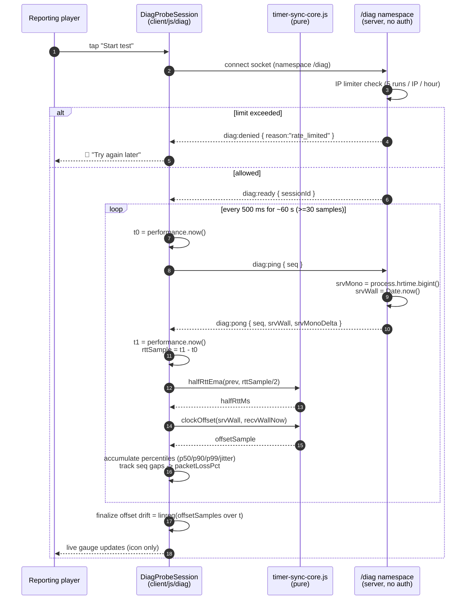

# Sequence — transport latency probe (`diag:ping` / `diag:pong`)

Measures **item 1 (latency)**: half-RTT percentiles, clock offset + drift, packet loss.
Context: [../../planning.md](../../planning.md) "What the page measures".

Dedicated path — does **not** touch the room, auth, or engine.io heartbeat.

## Notes

- `halfRttEma` / `clockOffset` are the **same** functions the room uses (R4) — extracted to
  `timer-sync-core.js` in sequencing step 1.
- Cadence (500 ms) is a probe choice, **not** a change to `pingInterval` — the #147/#152
  trap ("don't tighten pingInterval to measure better") does not apply because this is a
  separate namespace with its own message type.
- `srvMonoDelta` lets the client detect a server-side pause between receive and send
  (should be ~0); large values are dropped like B165 drops >30 s samples.
