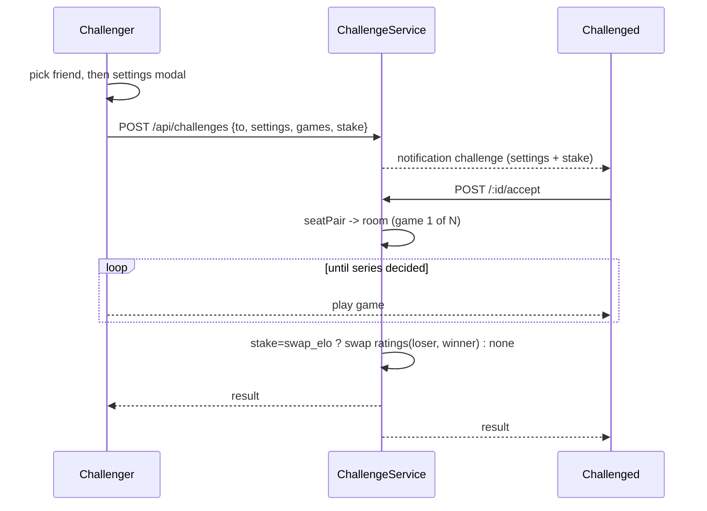

# Friend challenge — sequence

```mermaid
sequenceDiagram
  participant A as Challenger
  participant S as ChallengeService
  participant B as Challenged
  A->>A: pick friend, then settings modal
  A->>S: POST /api/challenges {to, settings, games, stake}
  S-->>B: notification challenge (settings + stake)
  B->>S: POST /:id/accept
  S->>S: seatPair -> room (game 1 of N)
  loop until series decided
    A-->>B: play game
  end
  S->>S: stake=swap_elo ? swap ratings(loser, winner) : none
  S-->>A: result
  S-->>B: result
```
