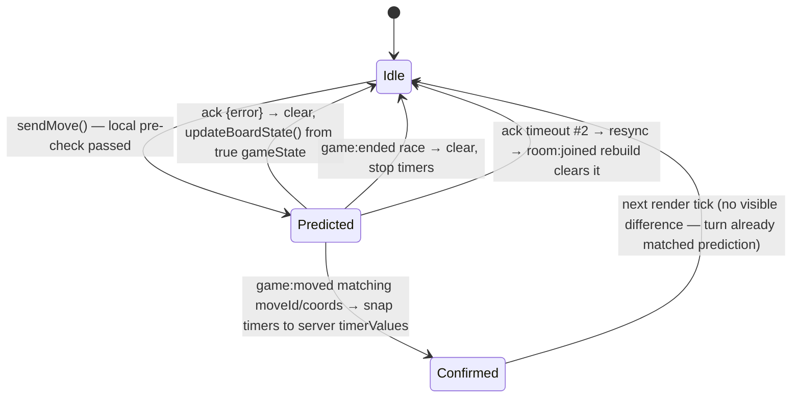

# State — predicted turn/timer overlay lifecycle

Mirrors `optimisticStone`'s lifecycle (board.js) but for the turn-bar/timer render layer proposed in
[../planning.md](../planning.md) Q2. Never mutates `gameState.currentTurn` — purely a render-time
override, same separation principle as the stone overlay.

