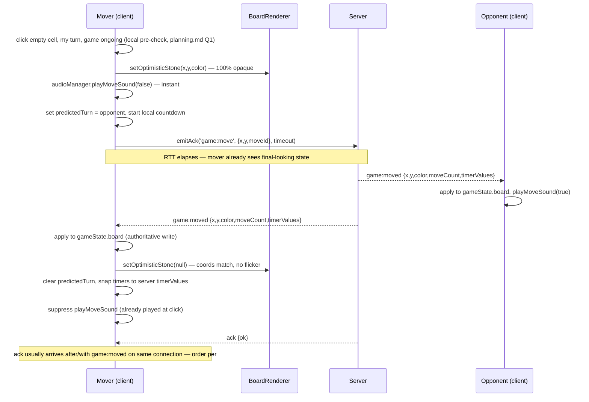

# Sequence — CSP happy path (mover's move confirmed)

See [../../planning.md](../../planning.md) Q2 for what `predictedTurn` is and why it exists
separately from `gameState.currentTurn`.

```mermaid
sequenceDiagram
    participant M as Mover (client)
    participant BR as BoardRenderer
    participant S as Server
    participant O as Opponent (client)

    M->>M: click empty cell, my turn, game ongoing (local pre-check, planning.md Q1)
    M->>BR: setOptimisticStone(x,y,color) — 100% opaque
    M->>M: audioManager.playMoveSound(false) — instant
    M->>M: set predictedTurn = opponent, start local countdown
    M->>S: emitAck('game:move', {x,y,moveId}, timeout)

    Note over M,S: RTT elapses — mover already sees final-looking state

    S-->>O: game:moved {x,y,color,moveCount,timerValues}
    O->>O: apply to gameState.board, playMoveSound(true)

    S-->>M: game:moved {x,y,color,moveCount,timerValues}
    M->>M: apply to gameState.board (authoritative write)
    M->>BR: setOptimisticStone(null) — coords match, no flicker
    M->>M: clear predictedTurn, snap timers to server timerValues
    M->>M: suppress playMoveSound (already played at click)

    S-->>M: ack {ok}
    Note over M: ack usually arrives after/with game:moved on same connection — order per #153 comment
```
