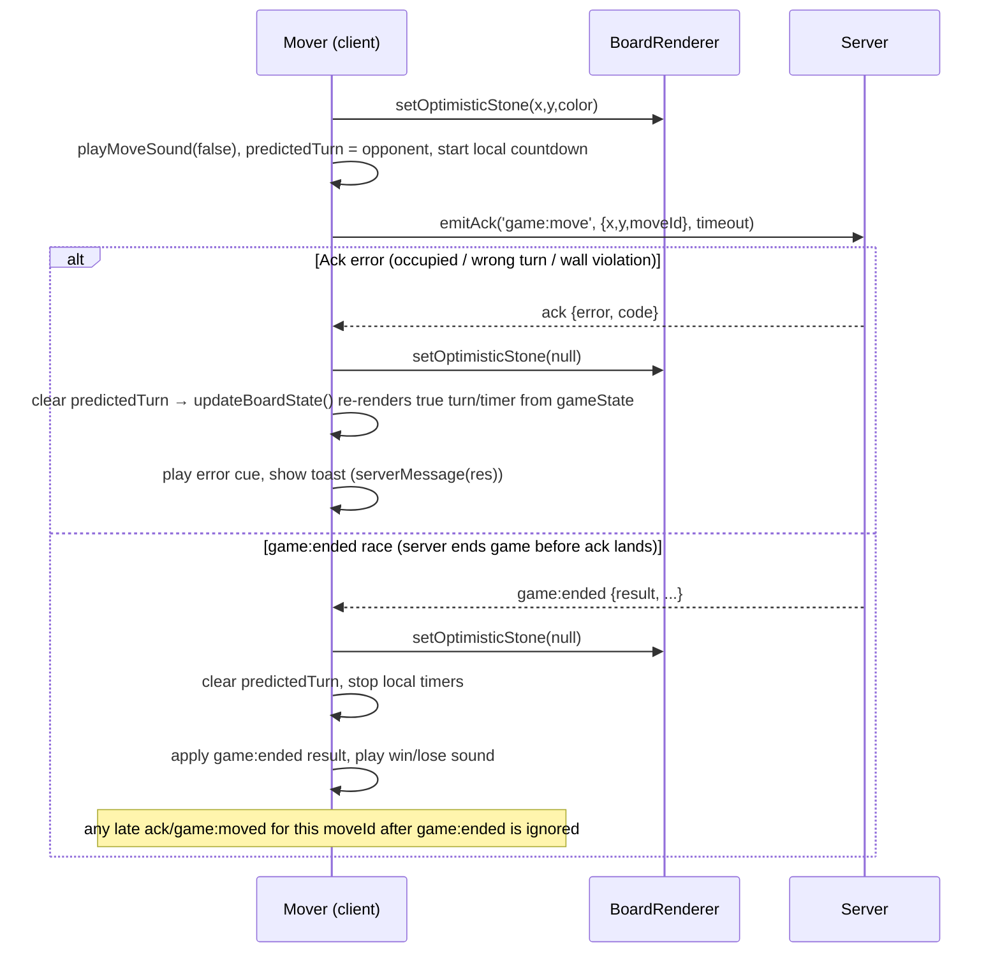

# Sequence — CSP rollback (ack error / game:ended race)

```mermaid
sequenceDiagram
    participant M as Mover (client)
    participant BR as BoardRenderer
    participant S as Server

    M->>BR: setOptimisticStone(x,y,color)
    M->>M: playMoveSound(false), predictedTurn = opponent, start local countdown
    M->>S: emitAck('game:move', {x,y,moveId}, timeout)

    alt Ack error (occupied / wrong turn / wall violation)
        S-->>M: ack {error, code}
        M->>BR: setOptimisticStone(null)
        M->>M: clear predictedTurn → updateBoardState() re-renders true turn/timer from gameState
        M->>M: play error cue, show toast (serverMessage(res))
    else game:ended race (server ends game before ack lands)
        S-->>M: game:ended {result, ...}
        M->>BR: setOptimisticStone(null)
        M->>M: clear predictedTurn, stop local timers
        M->>M: apply game:ended result, play win/lose sound
        Note over M: any late ack/game:moved for this moveId after game:ended is ignored
    end
```
