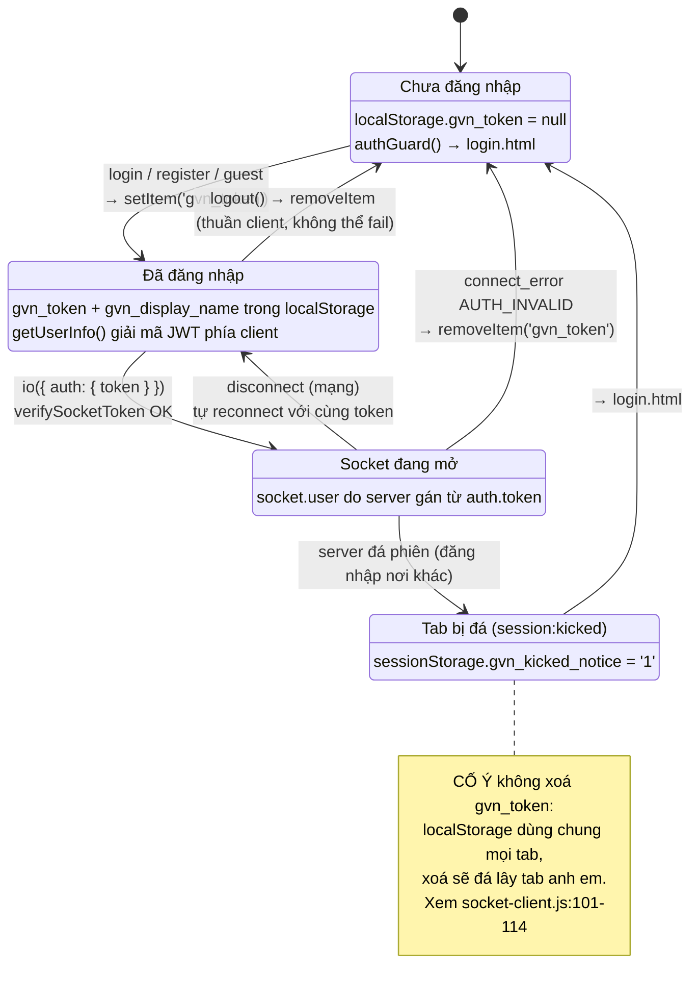
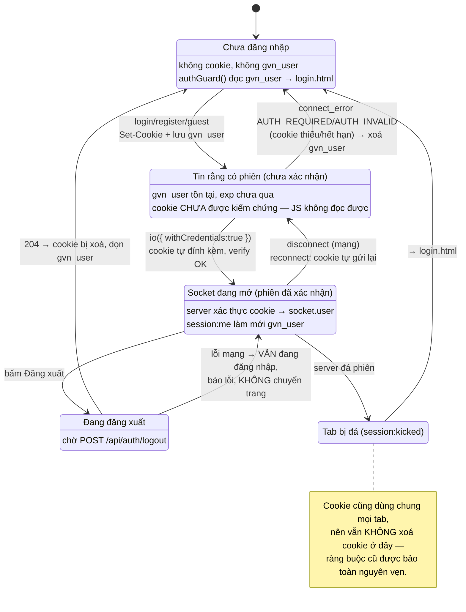

# State diagram — Trạng thái phiên phía client

Liên quan: [../user_story.md](../user_story.md) · [../planning.md](../planning.md) ·
[uml_diagram/sequence-login-and-socket-handshake.md](uml_diagram/sequence-login-and-socket-handshake.md)

## Hiện tại — một nguồn sự thật duy nhất: `localStorage.gvn_token`

JS vừa là nơi *giữ* bí mật, vừa là nơi *quyết định* đã đăng nhập hay chưa. Hai vai trò này bị gộp
làm một, và đó chính là thứ `HttpOnly` buộc phải tách ra.

## Đề xuất — tách bí mật (cookie) khỏi cờ phiên (profile)

Cookie giữ bí mật; `gvn_user` chỉ là **cache hiển thị không bí mật**, và server là nguồn sự thật
cuối cùng qua `session:me` / lỗi handshake.

## Trạng thái mới cần chú ý

Hai trạng thái dưới đây **không tồn tại** trong mô hình hiện tại và là nguồn lỗi tiềm tàng — cần
test riêng:

1. **`TinCoPhien` — "tin rằng có phiên" nhưng cookie đã mất.** Hôm nay token và cờ đăng nhập là
   *cùng một thứ*, nên không bao giờ lệch nhau. Sau khi tách, `gvn_user` có thể còn trong khi cookie
   đã hết hạn/bị xoá thủ công → user thấy giao diện lobby chớp lên rồi mới bị đá về login. Chấp nhận
   được, nhưng phải cố ý xử lý (ví dụ chỉ render sau `connect`, hoặc dựng skeleton), không để nó
   thành lỗi "nháy màn hình" bị báo lại sau.
2. **`DangDangXuat` — đăng xuất có thể thất bại.** Chuyển ngay về `login.html` mà không chờ 204 sẽ
   để lại cookie sống trên máy → user tưởng đã đăng xuất nhưng chưa. Đây là hồi quy bảo mật *do
   chính bản sửa bảo mật tạo ra* nếu làm ẩu.
