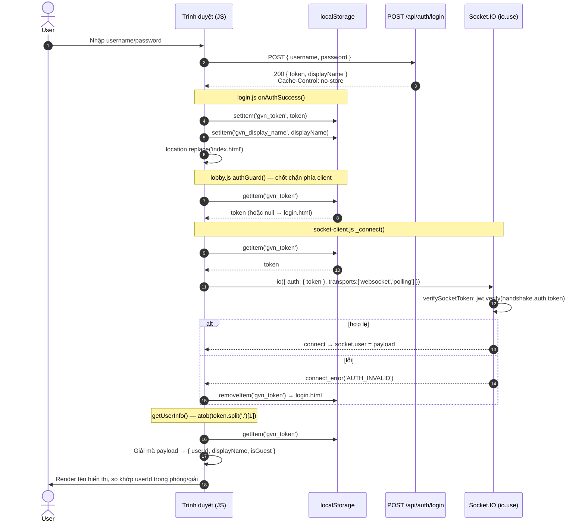

# Sequence — Đăng nhập & bắt tay Socket.IO: hiện tại vs. đề xuất

Liên quan: [../../user_story.md](../../user_story.md) · [../../planning.md](../../planning.md) ·
[../state-diagram-client-session.md](../state-diagram-client-session.md)

## 1. Luồng hiện tại (`localStorage`)

Token đi qua JS ở **mọi** chặng: lưu, đọc lại để mở socket, giải mã để lấy tên hiển thị.



**Điểm yếu:** bất kỳ JS nào cùng origin đều chạy được bước `getItem('gvn_token')` và mang token đi
chỗ khác.

## 2. Luồng đề xuất (`HttpOnly` cookie + profile không bí mật)

Token không bao giờ chạm vào JS. Danh tính **không bí mật** (userId, displayName, isGuest, exp) đi
theo một kênh riêng — đây là mấu chốt để `getUserInfo()` vẫn hoạt động.

```mermaid
sequenceDiagram
    autonumber
    actor U as User
    participant B as Trình duyệt (JS)
    participant CJ as Cookie jar (HttpOnly)
    participant SS as sessionStorage/localStorage<br/>(chỉ dữ liệu KHÔNG bí mật)
    participant API as POST /api/auth/login
    participant IO as Socket.IO (io.use)

    U->>B: Nhập username/password
    B->>API: POST { username, password } (credentials: 'same-origin')
    API->>CJ: Set-Cookie: gvn_token=<JWT>;<br/>HttpOnly; SameSite=Lax; Path=/;<br/>Secure (chỉ khi HTTPS); Max-Age=7d
    API-->>B: 200 { displayName, user: { userId, displayName, isGuest, exp } }
    Note right of API: Body KHÔNG còn chứa token
    B->>SS: lưu profile không bí mật (gvn_user)
    B->>B: location.replace('index.html')

    Note over B,SS: authGuard() đọc cờ profile, KHÔNG đọc token
    B->>SS: getItem('gvn_user')
    alt không có / exp đã qua
        B->>B: location.replace('login.html')
    end

    Note over B,IO: socket-client.js _connect() — không còn auth:{token}
    B->>IO: io({ withCredentials: true, ... })
    Note right of B: Trình duyệt tự đính Cookie:<br/>vào cả XHR polling lẫn WS upgrade (same-origin)
    IO->>IO: verifySocketToken:<br/>parse handshake.headers.cookie → jwt.verify(...)
    alt hợp lệ
        IO-->>B: connect → socket.user = payload
        IO-->>B: emit 'session:me' { userId, displayName, isGuest }
        Note right of IO: Nguồn sự thật cho danh tính;<br/>gvn_user chỉ là cache để tránh nháy UI
    else thiếu/hết hạn
        IO-->>B: connect_error('AUTH_REQUIRED' | 'AUTH_INVALID')
        B->>SS: removeItem('gvn_user') → login.html
        Note right of B: JS KHÔNG xoá được cookie HttpOnly;<br/>cookie hết hạn tự nhiên, hoặc gọi /logout
    end
```

### Ba khác biệt then chốt

| | Hiện tại | Đề xuất |
|---|---|---|
| Token tới client | Body JSON → `localStorage` | `Set-Cookie` (JS không đọc được) |
| Socket lấy token | `auth: { token }` do JS đọc | Trình duyệt tự gửi header `Cookie` |
| Danh tính cho UI | Giải mã JWT phía client | `session:me` từ server + cache `gvn_user` |

### Đăng xuất — bắt buộc phải có endpoint mới

Hiện tại `logout()` chỉ là `localStorage.removeItem(...)` — hoàn toàn phía client.
Với `HttpOnly`, JS không xoá được cookie, nên **phải** thêm `POST /api/auth/logout`:

```mermaid
sequenceDiagram
    autonumber
    actor U as User
    participant B as Trình duyệt (JS)
    participant CJ as Cookie jar
    participant API as POST /api/auth/logout

    U->>B: Bấm "Đăng xuất"
    B->>API: POST (credentials: 'same-origin')
    API->>CJ: Set-Cookie: gvn_token=; Max-Age=0<br/>(cùng Path/SameSite/Secure)
    API-->>B: 204
    B->>B: xoá gvn_user, socket.disconnect(), → login.html
```

> ⚠ Nếu `/api/auth/logout` lỗi mạng, cookie **vẫn còn** — client phải coi đăng xuất là *chưa xong*
> và báo lỗi, chứ không chuyển trang như thể đã đăng xuất. Đây là hành vi mới so với hôm nay
> (`removeItem` không bao giờ fail).
