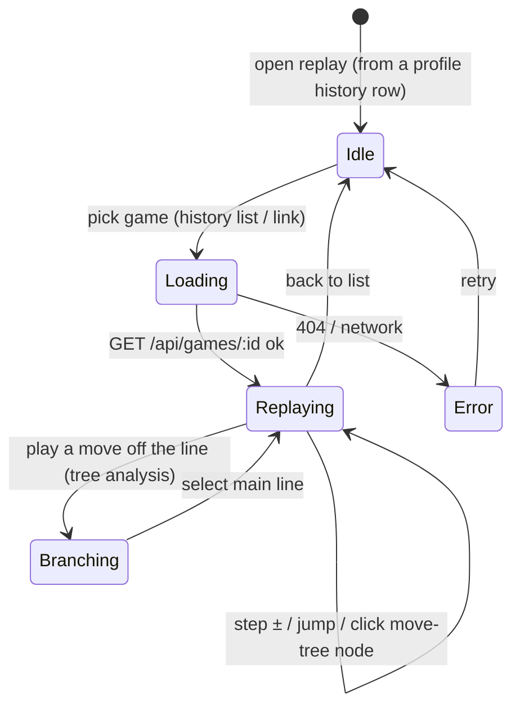

# Learn — replay state

```mermaid
stateDiagram-v2
  [*] --> Idle: open replay (from a profile history row)
  Idle --> Loading: pick game (history list / link)
  Loading --> Replaying: GET /api/games/:id ok
  Loading --> Error: 404 / network
  Replaying --> Replaying: step ± / jump / click move-tree node
  Replaying --> Branching: play a move off the line (tree analysis)
  Branching --> Replaying: select main line
  Replaying --> Idle: back to list
  Error --> Idle: retry
```
