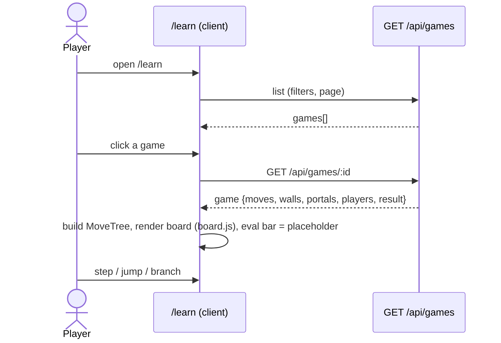

# Learn — open a replay

```mermaid
sequenceDiagram
  actor P as Player
  participant L as /learn (client)
  participant API as GET /api/games
  P->>L: open /learn#tab=history
  L->>API: list (filters, page)
  API-->>L: games[]
  P->>L: click a game
  L->>API: GET /api/games/:id
  API-->>L: game {moves, walls, portals, players, result}
  L->>L: build MoveTree, render board (board.js), eval bar = placeholder
  P->>L: step / jump / branch
```
