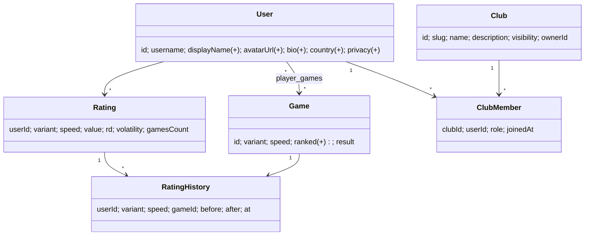

# Platform — domain model (release 1)
Status: draft. New tables marked (+); `users`, `games`, `player_games` exist.

```mermaid
classDiagram
  class User { id; username; displayName(+); avatarUrl(+); bio(+); country(+); privacy(+) }
  class Rating { userId; variant; speed; value; rd; volatility; gamesCount }
  class RatingHistory { userId; variant; speed; gameId; before; after; at }
  class Game { id; variant; speed; ranked(+); result }
  class Club { id; slug; name; description; visibility; ownerId }
  class ClubMember { clubId; userId; role; joinedAt }
  User "1" --> "*" Rating
  Rating "1" --> "*" RatingHistory
  Game "1" --> "*" RatingHistory
  User "*" --> "*" Game : player_games
  Club "1" --> "*" ClubMember
  User "1" --> "*" ClubMember
```
