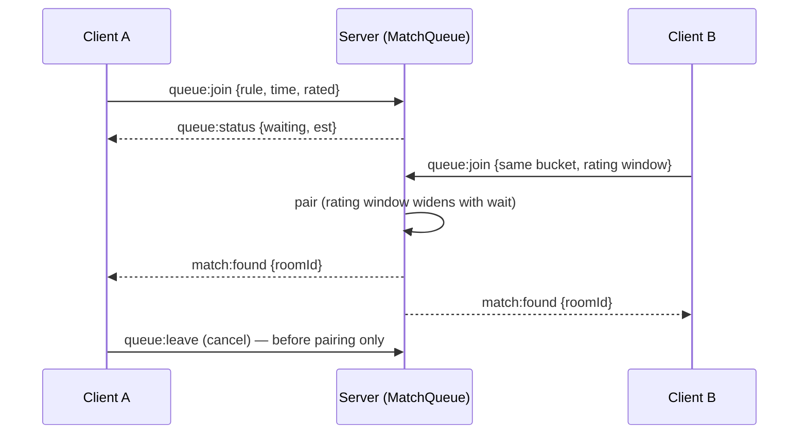

# Quick match (R3) — proposed, unconfirmed
Back: [planning § Release 2](../../planning.md#release-2--full-arena-mockup)

```mermaid
sequenceDiagram
  participant A as Client A
  participant S as Server (MatchQueue)
  participant B as Client B
  A->>S: queue:join {rule, time, rated}
  S-->>A: queue:status {waiting, est}
  B->>S: queue:join {same bucket, rating window}
  S->>S: pair (rating window widens with wait)
  S-->>A: match:found {roomId}
  S-->>B: match:found {roomId}
  A->>S: queue:leave (cancel) — before pairing only
```
