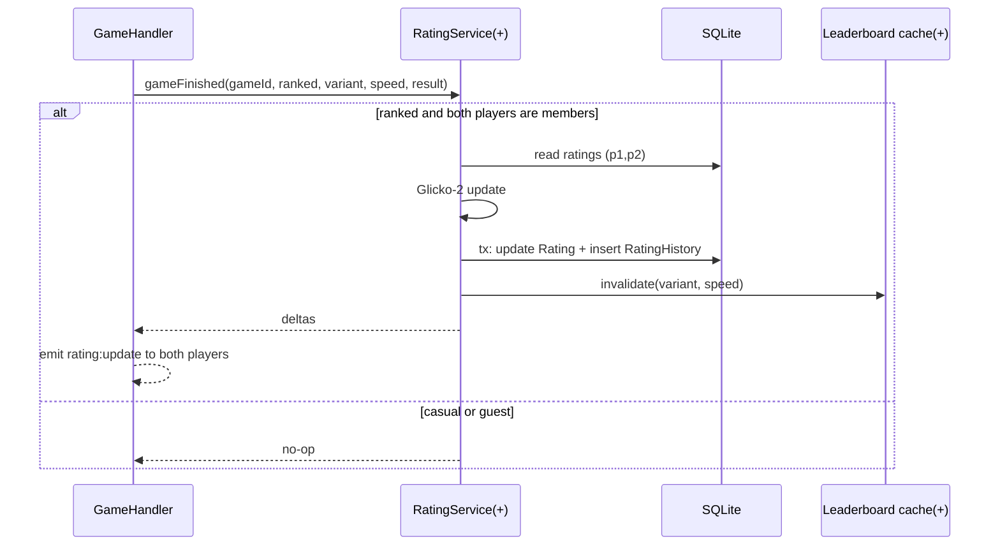

# Sequence — ranked game ends → rating + leaderboard
Status: draft.

```mermaid
sequenceDiagram
  participant GH as GameHandler
  participant RS as RatingService(+)
  participant DB as SQLite
  participant LB as Leaderboard cache(+)
  GH->>RS: gameFinished(gameId, ranked, variant, speed, result)
  alt ranked and both players are members
    RS->>DB: read ratings (p1,p2)
    RS->>RS: Glicko-2 update
    RS->>DB: tx: update Rating + insert RatingHistory
    RS->>LB: invalidate(variant, speed)
    RS-->>GH: deltas
    GH-->>GH: emit rating:update to both players
  else casual or guest
    RS-->>GH: no-op
  end
```
