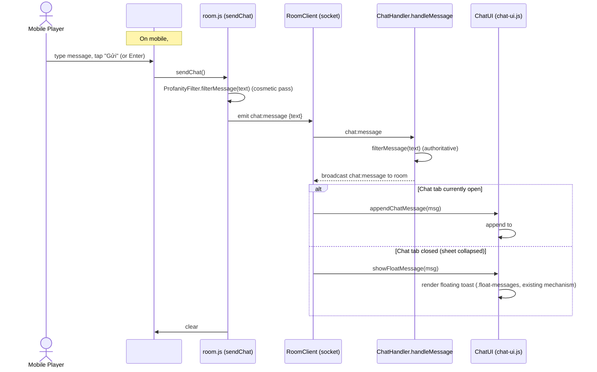

# Sequence — Sending a Message from the Mobile Quick Chat Bar

Shows that the send path is unchanged from today — only where `#chat-input-wrapper` lives in the DOM
changes. `sendChat()` and the server-side handler are reused as-is.

## Notes

- No new socket event, no server-side change — `ChatHandler.handleMessage` and the `chat:message`
  contract are untouched.
- The only behavioral delta from today is *where the input sits* and *when its containing tab is
  active*; message delivery/rendering reuses the existing dual path (`appendChatMessage` vs.
  `showFloatMessage`) that already handles "tab open" vs. "tab not open."
