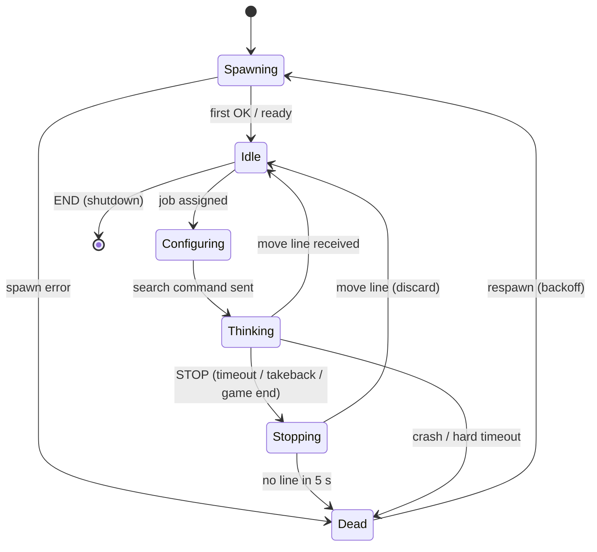

# Engine instance state

```mermaid
stateDiagram-v2
  [*] --> Spawning
  Spawning --> Idle: first OK / ready
  Spawning --> Dead: spawn error
  Idle --> Configuring: job assigned
  Configuring --> Thinking: search command sent
  Thinking --> Idle: move line received
  Thinking --> Stopping: STOP (timeout / takeback / game end)
  Stopping --> Idle: move line (discard)
  Stopping --> Dead: no line in 5 s
  Thinking --> Dead: crash / hard timeout
  Dead --> Spawning: respawn (backoff)
  Idle --> [*]: END (shutdown)
```
Commands sent in `Thinking` are dropped by the engine except STOP/END (engine-integration §3).
