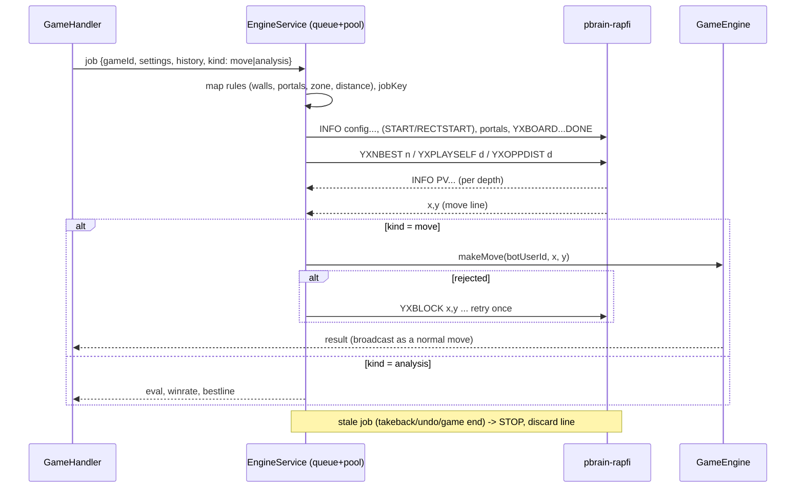

# Bot move / analysis job

```mermaid
sequenceDiagram
  participant H as GameHandler
  participant E as EngineService (queue+pool)
  participant P as pbrain-rapfi
  participant G as GameEngine
  H->>E: job {gameId, settings, history, kind: move|analysis}
  E->>E: map rules (walls, portals, zone, distance), jobKey
  E->>P: INFO config..., (START/RECTSTART), portals, YXBOARD...DONE
  E->>P: YXNBEST n / YXPLAYSELF d / YXOPPDIST d
  P-->>E: INFO PV... (per depth)
  P-->>E: x,y  (move line)
  alt kind = move
    E->>G: makeMove(botUserId, x, y)
    alt rejected
      E->>P: YXBLOCK x,y ... retry once
    end
    G-->>H: result (broadcast as a normal move)
  else kind = analysis
    E-->>H: eval, winrate, bestline
  end
  Note over E,P: stale job (takeback/undo/game end) -> STOP, discard line
```
