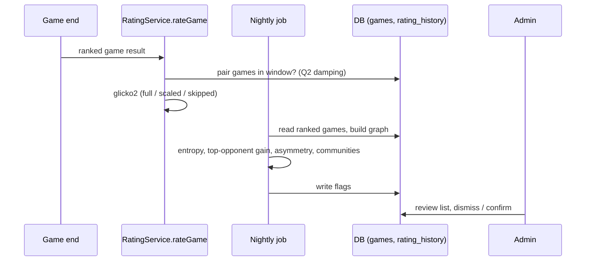

# Rating integrity — sequence

```mermaid
sequenceDiagram
  participant G as Game end
  participant R as RatingService.rateGame
  participant J as Nightly job
  participant D as DB (games, rating_history)
  participant A as Admin
  G->>R: ranked game result
  R->>D: pair games in window? (Q2 damping)
  R->>R: glicko2 (full / scaled / skipped)
  J->>D: read ranked games, build graph
  J->>J: entropy, top-opponent gain, asymmetry, communities
  J->>D: write flags
  A->>D: review list, dismiss / confirm
```
