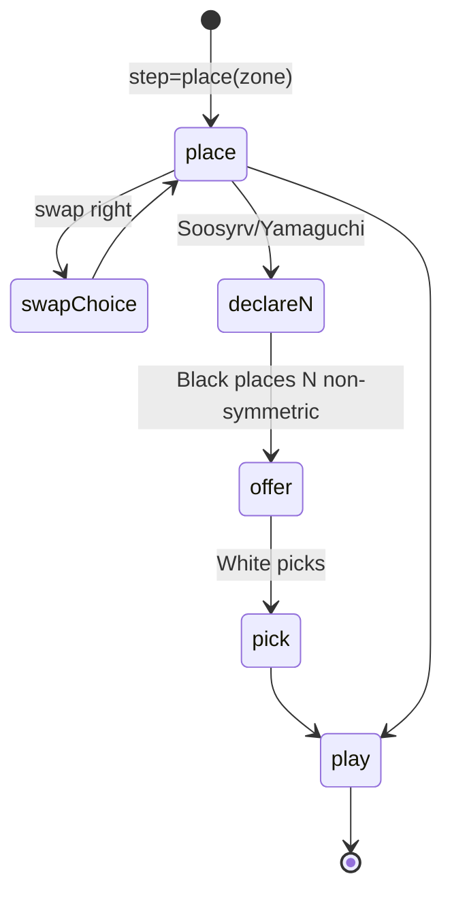

# Opening state machine (data-driven)

```mermaid
stateDiagram-v2
  [*] --> place: step=place(zone)
  place --> swapChoice: swap right
  swapChoice --> place
  place --> declareN: Soosyrv/Yamaguchi
  declareN --> offer: Black places N non-symmetric
  offer --> pick: White picks
  pick --> play
  place --> play
  play --> [*]
```
Back: [user_story](../user_story.md)
