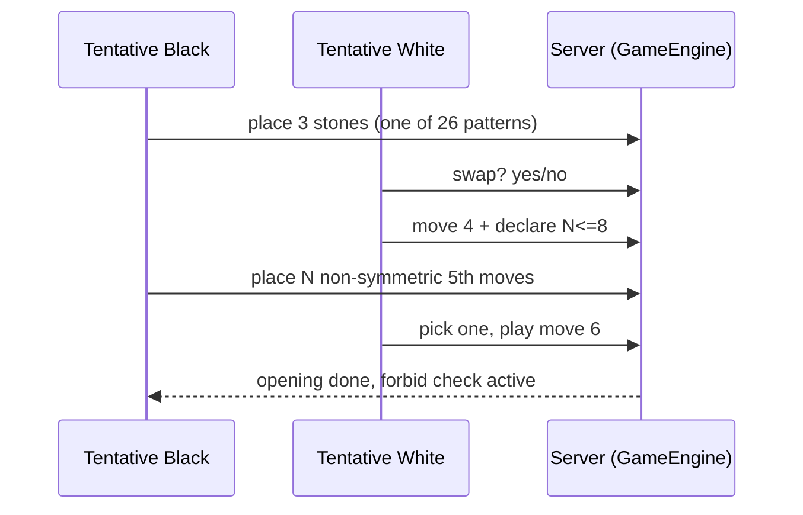

# Sequence: Soosyrv-8

```mermaid
sequenceDiagram
  participant B as Tentative Black
  participant W as Tentative White
  participant S as Server (GameEngine)
  B->>S: place 3 stones (one of 26 patterns)
  W->>S: swap? yes/no
  W->>S: move 4 + declare N<=8
  B->>S: place N non-symmetric 5th moves
  W->>S: pick one, play move 6
  S-->>B: opening done, forbid check active
```
Back: [user_story](../../user_story.md)
