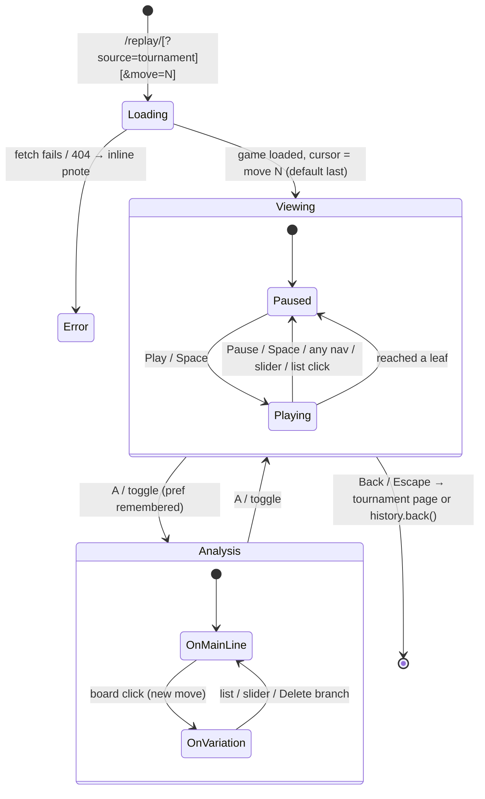

# Replay page — state

Links: [user stories](../user_story.md) · [planning](../planning.md) · [sequence](uml_diagram/sequence.md)

```mermaid
stateDiagram-v2
  [*] --> Loading: /replay/<id>[?source=tournament][&move=N]
  Loading --> Error: fetch fails / 404 → inline pnote
  Loading --> Viewing: game loaded, cursor = move N (default last)
  state Viewing {
    [*] --> Paused
    Paused --> Playing: Play / Space
    Playing --> Paused: Pause / Space / any nav / slider / list click
    Playing --> Paused: reached a leaf
  }
  Viewing --> Analysis: A / toggle (pref remembered)
  Analysis --> Viewing: A / toggle
  state Analysis {
    [*] --> OnMainLine
    OnMainLine --> OnVariation: board click (new move)
    OnVariation --> OnMainLine: list / slider / Delete branch
  }
  Viewing --> [*]: Back / Escape → tournament page or history.back()
```
