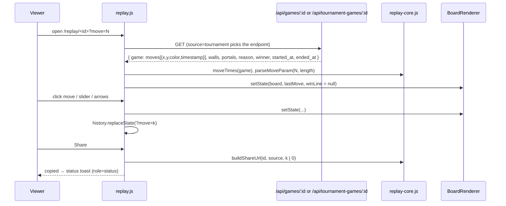

# Replay page — load and share sequence

Links: [user stories](../../user_story.md) · [planning](../../planning.md) · [state](../state.md)

```mermaid
sequenceDiagram
  participant U as Viewer
  participant P as replay.js
  participant API as /api/games/:id or /api/tournament-games/:id
  participant C as replay-core.js
  participant B as BoardRenderer
  U->>P: open /replay/<id>?move=N
  P->>API: GET (source=tournament picks the endpoint)
  API-->>P: { game: moves[{x,y,color,timestamp}], walls, portals, reason, winner, started_at, ended_at }
  P->>C: moveTimes(game), parseMoveParam(N, length)
  P->>B: setState(board, lastMove, winLine = null)
  U->>P: click move / slider / arrows
  P->>B: setState(...)
  P->>P: history.replaceState(?move=k)
  U->>P: Share
  P->>C: buildShareUrl(id, source, k | 0)
  P-->>U: copied → status toast (role=status)
```
