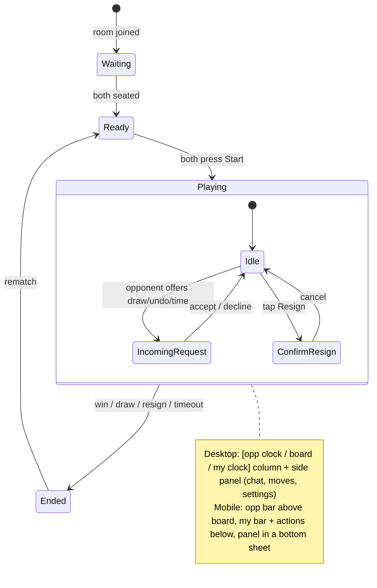

# Room layout states

Back: [user_story.md](../user_story.md) · [planning.md](../planning.md)

```mermaid
stateDiagram-v2
  [*] --> Waiting: room joined
  Waiting --> Ready: both seated
  Ready --> Playing: both press Start
  Playing --> Ended: win / draw / resign / timeout
  Ended --> Ready: rematch
  state Playing {
    [*] --> Idle
    Idle --> IncomingRequest: opponent offers draw/undo/time
    IncomingRequest --> Idle: accept / decline
    Idle --> ConfirmResign: tap Resign
    ConfirmResign --> Idle: cancel
  }
  note right of Playing
    Desktop: [opp clock / board / my clock] column + side panel (chat, moves, settings)
    Mobile: opp bar above board, my bar + actions below, panel in a bottom sheet
  end note
```
