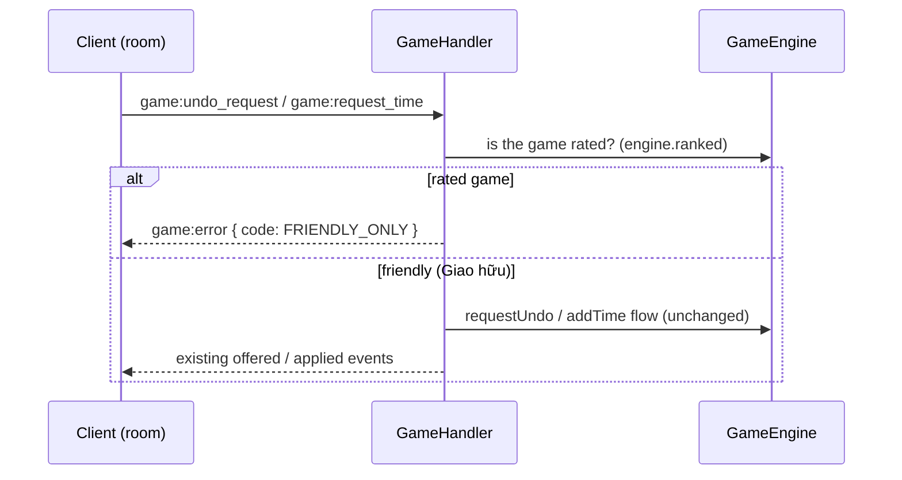

# Friendly-only undo / extra time — sequence

Back: [user_story.md](../../user_story.md) · [planning.md](../../planning.md)

```mermaid
sequenceDiagram
  participant C as Client (room)
  participant H as GameHandler
  participant E as GameEngine
  C->>H: game:undo_request / game:request_time
  H->>E: is the game rated? (engine.ranked)
  alt rated game
    H-->>C: game:error { code: FRIENDLY_ONLY }
  else friendly (Giao hữu)
    H->>E: requestUndo / addTime flow (unchanged)
    H-->>C: existing offered / applied events
  end
```
