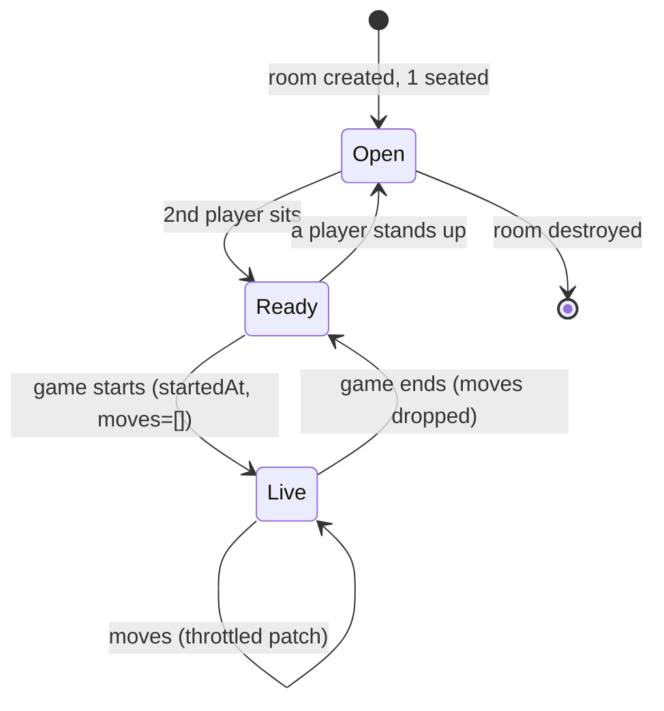

# Room card states (#364)

```mermaid
stateDiagram-v2
  [*] --> Open: room created, 1 seated
  Open --> Ready: 2nd player sits
  Ready --> Open: a player stands up
  Ready --> Live: game starts (startedAt, moves=[])
  Live --> Live: moves (throttled patch)
  Live --> Ready: game ends (moves dropped)
  Open --> [*]: room destroyed
```
Open = empty board + "Ngồi vào" · Ready = empty board, "Sắp bắt đầu" · Live = mini board, elapsed, watchers.
