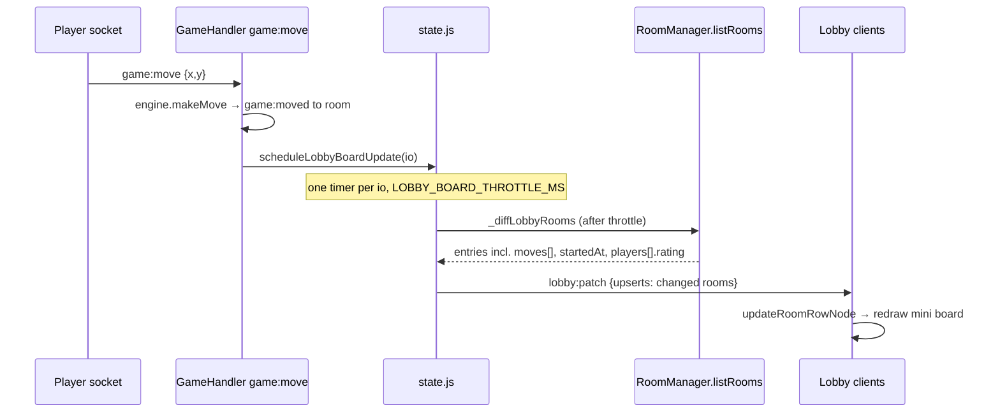

# Lobby mini-board refresh (#364)

```mermaid
sequenceDiagram
  participant P as Player socket
  participant G as GameHandler game:move
  participant S as state.js
  participant R as RoomManager.listRooms
  participant L as Lobby clients
  P->>G: game:move {x,y}
  G->>G: engine.makeMove → game:moved to room
  G->>S: scheduleLobbyBoardUpdate(io)
  Note over S: one timer per io, LOBBY_BOARD_THROTTLE_MS
  S->>R: _diffLobbyRooms (after throttle)
  R-->>S: entries incl. moves[], startedAt, players[].rating
  S->>L: lobby:patch {upserts: changed rooms}
  L->>L: updateRoomRowNode → redraw mini board
```
