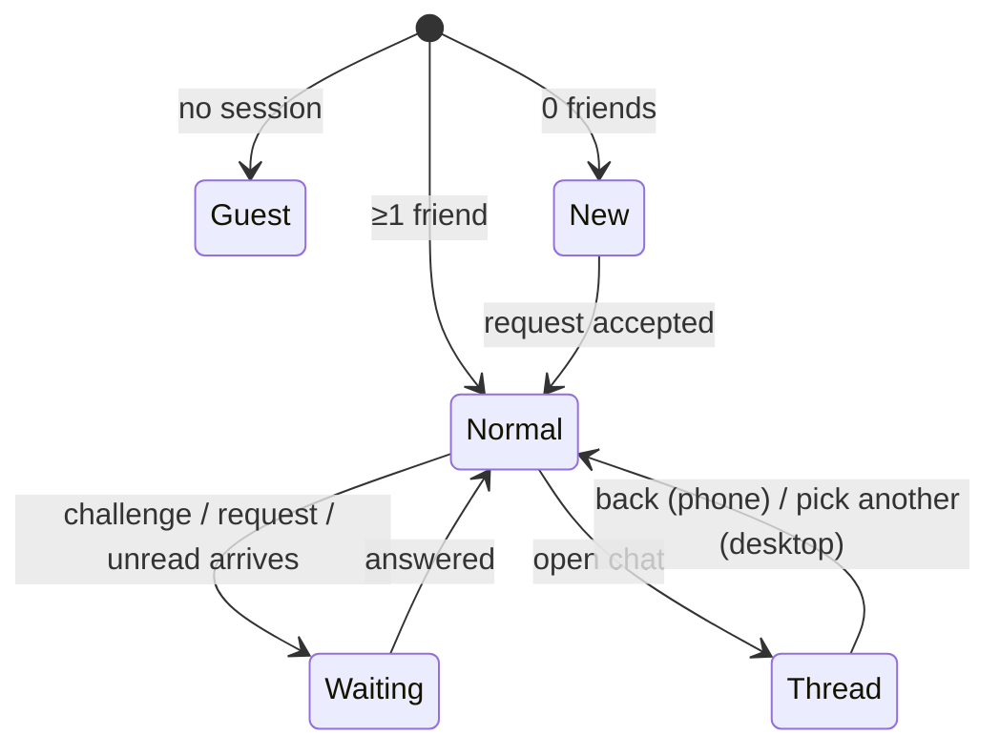

# Bạn bè page — states

Back: [user_story.md](../user_story.md) · [planning.md](../planning.md)

```mermaid
stateDiagram-v2
  [*] --> Guest: no session
  [*] --> New: 0 friends
  [*] --> Normal: ≥1 friend
  New --> Normal: request accepted
  Normal --> Waiting: challenge / request / unread arrives
  Waiting --> Normal: answered
  Normal --> Thread: open chat
  Thread --> Normal: back (phone) / pick another (desktop)
```

Every mockup is shot in New (`-sparse`), Normal, busy Normal (`-busy`) and Thread (`375-thread`).
