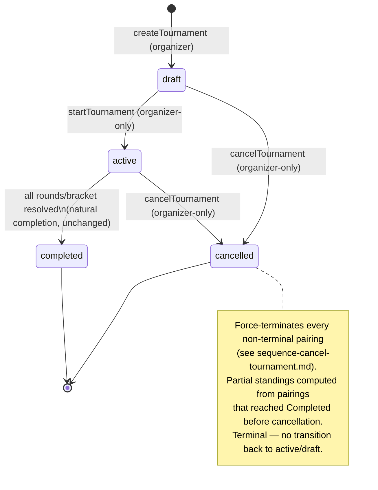

# State Diagram — Tournament Lifecycle with Cancellation

Extends the base tournament lifecycle (`draft -> active -> completed`, `TournamentManager.js:104`,
`startTournament()`, `_completeTournament()`) with a fourth terminal status, `cancelled`, reachable
from either pre-completion state.

Not reachable: `completed -> cancelled` (a finished tournament can't retroactively be cancelled) and
`cancelled -> cancelled` (idempotent guard — the second cancel attempt is rejected, not a no-op
transition).
