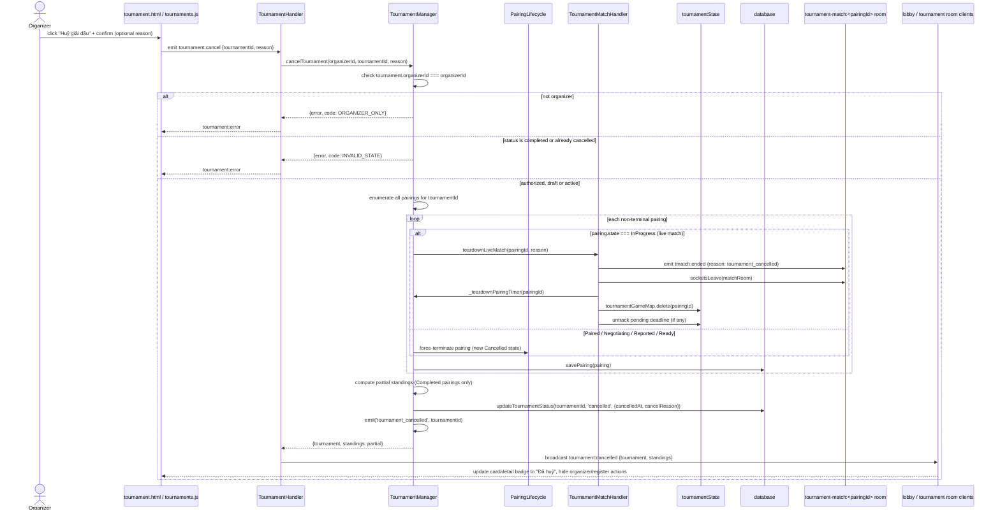

# Sequence — Organizer Cancels a Tournament

Covers the full fan-out from one `tournament:cancel` call: authorization, force-terminating every
non-terminal pairing (including tearing down a live match), partial standings, and broadcasting the
result to every affected client (the organizer, players mid-game, players/spectators just watching,
and the lobby list).

## Notes

- The `InProgress` branch is the only one requiring live socket/timer teardown — every other
  non-terminal state (`Paired`/`Negotiating`/`Reported`/`Ready`) has no active `GameEngine`/
  `TimerManager` yet, so force-terminating them is a pure state-field mutation, no socket work.
- `tmatch:ended`'s `reason: tournament_cancelled` (vs. reusing a brand-new event name) is an open
  question — see [../planning.md](../planning.md#open-questions-non-blocking--can-default-and-adjust-later)
  question 2.
- The broadcast target ("Lobby" in the diagram) needs to reach three distinct client contexts that
  may all be open simultaneously: (1) the organizer's own tab, (2) any player/visitor sitting on
  `tournament.html` for this tournament (already joined `tournamentRoom(tournamentId)` via
  `tournament:get`), and (3) the lobby list (`tournaments.js`) showing this tournament's card to
  everyone browsing — verify at implementation time which existing room/channel already covers all
  three, or whether more than one emit target is needed.
