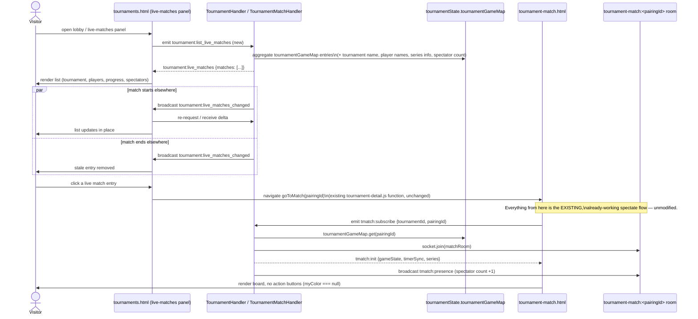

# Sequence — Visitor Browses and Joins a Live Tournament Match

Covers the new discovery layer (live-matches browser) feeding into the already-existing, unmodified
spectate flow (`tmatch:subscribe`).

