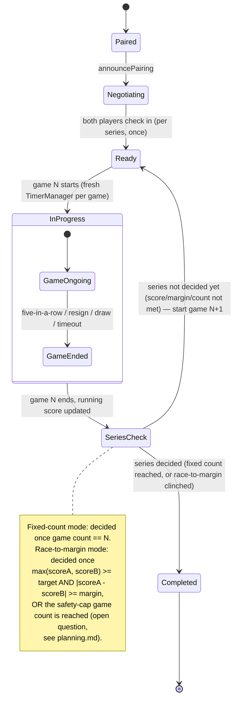

# State Diagram — Pairing with Game Series

Extends the base pairing lifecycle (`PairingLifecycle.js`: `Paired -> Negotiating -> ... -> Ready ->
InProgress -> Completed`, see [../../tournament/diagram/state-diagram-match-lifecycle.md](../../tournament/diagram/state-diagram-match-lifecycle.md))
by looping `Ready <-> InProgress` for each individual game in the series, instead of ending the
pairing after one game.

Unresolved in this diagram (tracked as open questions in [../planning.md](../planning.md)):

- Whether scheduling/deadline negotiation (`Paired -> Negotiating -> Ready`) happens once per
  pairing or is re-entered before each game in the series.
- Whether a no-show mid-series ends only that game (walkover for that game, series continues) or
  ends the whole pairing (walkover for the series).
