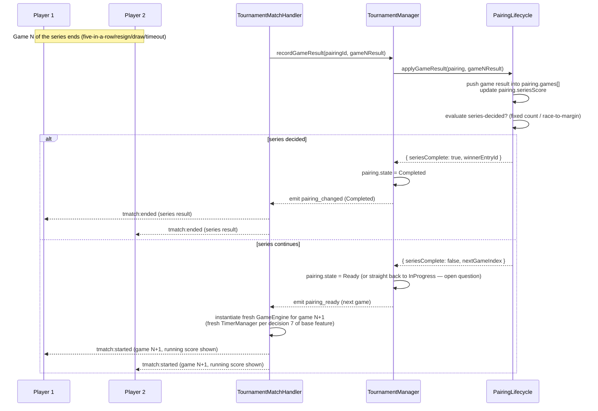

# Sequence — Finishing One Game, Starting the Next in the Series

Illustrates the open question of how `TournamentMatchHandler`/`TournamentManager` would need to
react when a game inside a series ends but the pairing isn't decided yet (see
[../../planning.md](../planning.md)). This is a **proposed** flow, not yet implemented or confirmed
— contrast with [../../tournament/diagram/uml_diagram/sequence-match-scheduling.md](../../tournament/diagram/uml_diagram/sequence-match-scheduling.md)
which documents the already-built single-game flow.

