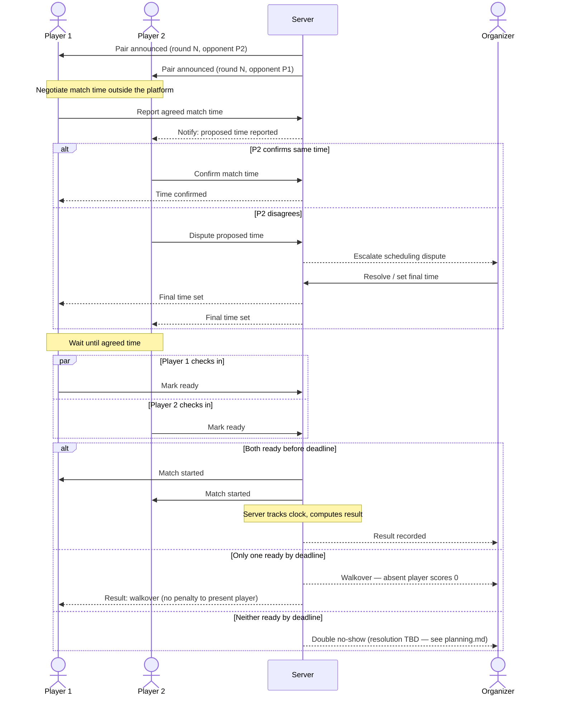

# Sequence Diagram — Self-Scheduled Match Flow

Covers the "World Blitz Cup"-style flow: players negotiate a time between themselves, report it to
the server, then check in when ready. See [user_story.md](../../user_story.md) for the story this
diagram illustrates, and [../state-diagram-match-lifecycle.md](../state-diagram-match-lifecycle.md)
for the resulting match states.

