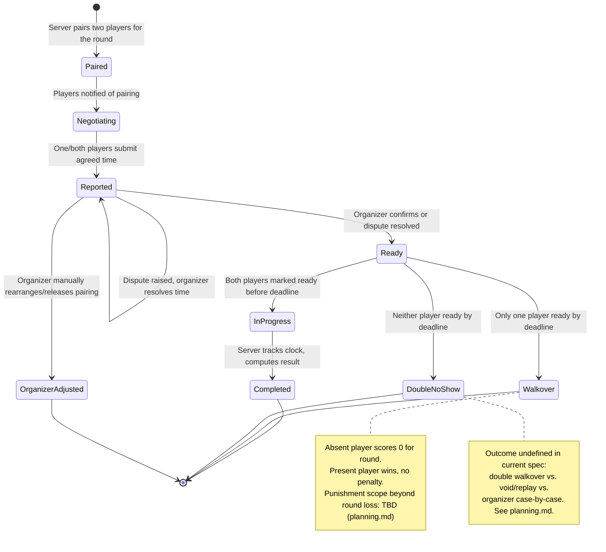
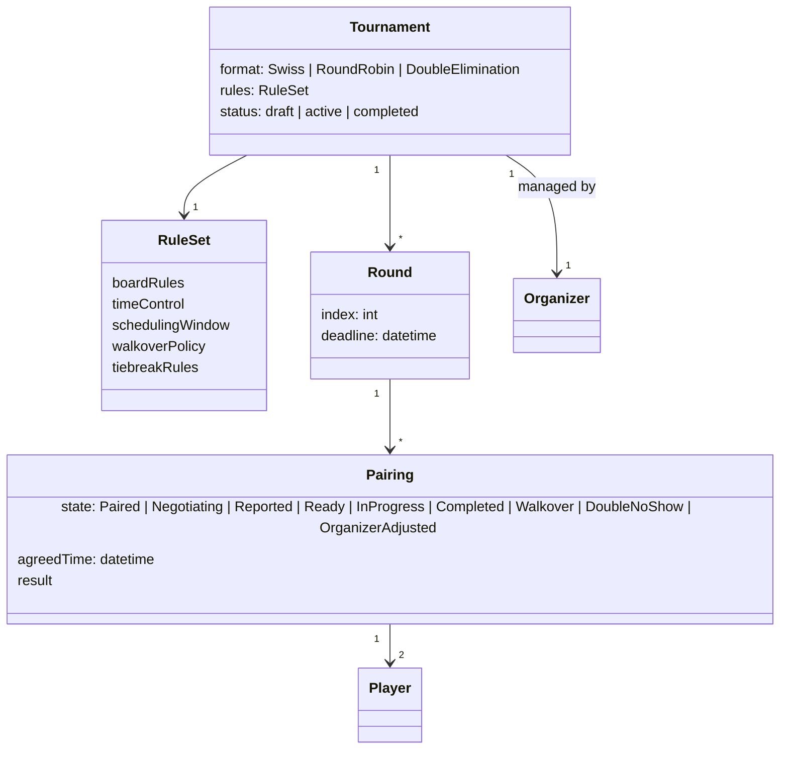

# Structure & Behavior Diagram — Match Lifecycle (State Machine)

Behavioral counterpart to [uml_diagram/sequence-match-scheduling.md](uml_diagram/sequence-match-scheduling.md):
the states a single paired match moves through, independent of message order.

## Class-level structure (conceptual, pre-implementation)

Entities implied by the states above — **not** a finalized data model, just enough structure to
reason about the diagram. Actual schema is deferred to implementation planning.

