# State — Undo request lifecycle

Per-game pending-request state, analogous to `drawOffer` on `GameEngine`
(`server/managers/GameEngine.js:439-489`). Exact container (engine vs. room) is open — see
[../planning.md](../planning.md) question #1.

```mermaid
stateDiagram-v2
    [*] --> Idle

    Idle --> Pending: requestUndo(userId)\n[game ongoing, requester's turn,\nopeningPhase == 'play', no pending offer]
    Idle --> Idle: requestUndo(userId) rejected\n(wrong turn / opening phase / no game)

    Pending --> Idle: acceptUndo(opponentId)\n→ rollback applied, currentTurn = requester
    Pending --> Idle: declineUndo(opponentId)\n→ no state change
    Pending --> Idle: acceptUndo/declineUndo(requesterId)\n→ rejected (cannot self-resolve)

    Idle --> Idle: makeMove() by either player\n(no pending offer to clear)
    Pending --> Idle: makeMove() attempted\n[blocked while Pending — mirrors\ndrawOffer not blocking moves today;\nconfirm whether Undo should differ]

    note right of Pending
        Open question (planning.md #7): does a
        disconnect from either player clear
        Pending, or does it persist until the
        next explicit action (matches existing
        drawOffer/_timeRequestPending gap)?
    end note
```

