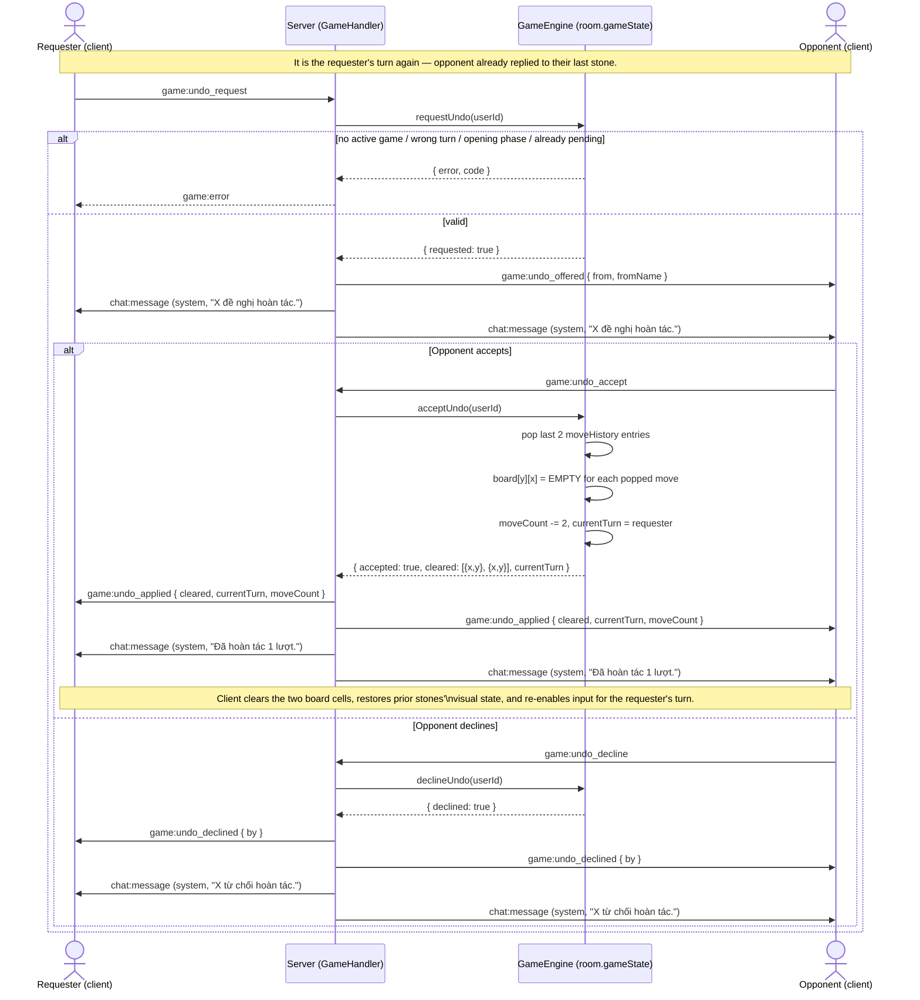

# Sequence — Undo request → approve → rollback

Illustrative only — event names (`game:undo_request`, `game:undo_applied`, etc.) and the exact
pending-state container are still open questions (see [../../planning.md](../../planning.md)
questions #1-3). Modeled on the existing `game:draw_offer`/`game:draw_accept` flow
(`server/socket/handlers/GameHandler.js:243-286`).

## Notes

- Mirrors the self-accept/self-decline guard already present in `acceptDraw`/`declineDraw`
  (`GameEngine.js:464`, `:485`) — the requester cannot accept/decline their own request.
- `game:undo_applied` is a **new** payload shape (cell-clearing), unlike `game:moved` which is
  fill-only (`GameHandler.js:79-85`) — see [user_story.md](../../user_story.md) precedent notes.
- Timer restoration on accept is intentionally left out of this diagram — see planning.md question #5.
